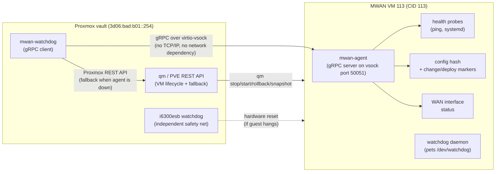

# Two-Service gRPC Architecture over virtio-vsock

## Problem

The watchdog on Proxmox uses `qm guest exec` to query the MWAN VM's health. Each call takes ~2 seconds, depends on the QEMU guest agent, and returns unstructured text. Worse, health queries travel over the management network (TCP on vmbr0), which could itself be affected by the networking failures the watchdog is trying to detect. The VM needs a proper agent with a typed API on a transport that works even when all networking is broken.

## Prior Art

Three established patterns informed this design:

- **Proxmox hardware watchdog (i6300esb)**: Emulated watchdog device inside the VM. Guest daemon pets `/dev/watchdog`; if it stops, the watchdog resets the VM. Simple, catches hard crashes. Doesn't detect networking failures or do rollbacks. We enable this as an independent safety net.

- **oVirt guest agent**: Python agent communicating with the host (VDSM) over VirtIO serial. JSON messages terminated by newlines. Reports system info and heartbeats. Proven pattern, archived in 2022.

- **Shaken Fist sidechannel**: Protobuf messages over **virtio-vsock**. Persistent connection for health (ping/pong), separate connections for operations. This is the closest model to what we're building.

## Architecture



## Why virtio-vsock

virtio-vsock (`AF_VSOCK`) is a socket address family for direct hypervisor-to-VM communication:

- **No TCP/IP dependency.** Works even when the VM has zero network configuration. This breaks the circular dependency where the monitoring channel depends on the same networking it's monitoring.
- **No bridge, no firewall, no routing.** The channel is a direct QEMU-to-guest pipe via the vhost-vsock kernel module.
- Host is always CID 2, VMs get unique CIDs (we use CID 113 to match the VMID).
- Proxmox 8 (kernel 6.x, QEMU 8+) satisfies all requirements.
- **Go library**: [`mdlayher/vsock`](https://github.com/mdlayher/vsock) v1.2.1 (MIT, actively maintained, last updated 2025-02). It implements standard `net.Listener` and `net.Conn`, so **gRPC runs directly on top of it** with no changes to the gRPC code.

### Proxmox VM config change

Add a vhost-vsock-pci device to VM 113. In `/etc/pve/qemu-server/113.conf`:
```
args: -device vhost-vsock-pci,guest-cid=113
watchdog: model=i6300esb,action=reset
```

The `vhost_vsock` kernel module must be loaded on the Proxmox host (`modprobe vhost_vsock`; add to `/etc/modules` for persistence).

## Communication Tiers

```
Tier 1: gRPC over virtio-vsock
  - Primary channel. Works without any network.
  - Agent serves health, config, ping, system info, push events.
  - Go library: mdlayher/vsock + google.golang.org/grpc

Tier 2: Proxmox REST API via net/http
  - Fallback when gRPC agent is down (agent crashed, VM booting, agent not yet deployed).
  - POST /api2/json/nodes/{node}/qemu/{vmid}/agent/exec
  - GET  /api2/json/nodes/{node}/qemu/{vmid}/agent/exec-status?pid={pid}
  - Authenticated with PROXMOX_API_TOKEN. Calls https://localhost:8006/... from vault.
  - Pure stdlib net/http. ~50 lines. Self-signed cert handled with InsecureSkipVerify for localhost.

Tier 3: i6300esb hardware watchdog (independent)
  - Not a "fallback" in the same chain; runs independently inside the VM.
  - Catches kernel panics and hard hangs that nothing else sees.
  - Guest runs the standard watchdog daemon (apt install watchdog).
```

## Service 1: mwan-agent (VM-side)

A long-running gRPC server inside the MWAN VM. Listens on vsock port 50051. Replaces all `qm guest exec` health/config queries.

### gRPC Service Definition

```protobuf
syntax = "proto3";
package mwan.v1;

service MWANAgent {
  // Unary RPCs: watchdog queries agent
  rpc GetHealth(GetHealthRequest) returns (GetHealthResponse);
  rpc Ping(PingRequest) returns (PingResponse);
  rpc GetConfigState(GetConfigStateRequest) returns (GetConfigStateResponse);
  rpc GetSystemInfo(GetSystemInfoRequest) returns (GetSystemInfoResponse);

  // Server-streaming: agent pushes events to watchdog
  rpc WatchEvents(WatchEventsRequest) returns (stream AgentEvent);
}

message GetHealthRequest {}
message GetHealthResponse {
  bool ipv4_ok = 1;
  bool ipv6_ok = 2;
  repeated WANStatus wan_interfaces = 3;
  repeated string failed_units = 4;
}

message WANStatus {
  string name = 1;
  bool link_up = 2;
  bool ipv4_reachable = 3;
  bool ipv6_reachable = 4;
}

message PingRequest {
  string target = 1;
  string bind_interface = 2;
  int32 count = 3;
  int32 timeout_seconds = 4;
}
message PingResponse {
  bool success = 1;
  int32 packets_received = 2;
}

message GetConfigStateRequest {}
message GetConfigStateResponse {
  string config_hash = 1;
  int64 last_deploy_epoch = 2;
  int64 last_change_epoch = 3;
}

message GetSystemInfoRequest {}
message GetSystemInfoResponse {
  string hostname = 1;
  int64 uptime_seconds = 2;
  string load_average = 3;
  int64 memory_used_bytes = 4;
  int64 memory_total_bytes = 5;
  int64 disk_used_bytes = 6;
  int64 disk_total_bytes = 7;
}

message WatchEventsRequest {}
message AgentEvent {
  int64 timestamp_epoch = 1;
  oneof event {
    ConfigChangedEvent config_changed = 2;
    HealthTransitionEvent health_transition = 3;
    SuppressRollbackEvent suppress_rollback = 4;
  }
}

message ConfigChangedEvent {
  string old_hash = 1;
  string new_hash = 2;
}
message HealthTransitionEvent {
  string interface_name = 1;
  string old_state = 2;
  string new_state = 3;
}
message SuppressRollbackEvent {
  int32 duration_seconds = 1;
  string reason = 2;
}
```

### What mwan-agent absorbs

- All connectivity probes currently done via `qm guest exec 113 -- ping ...`
- Config hash computation (from the change-detect plan)
- Deploy/change timestamp reads
- System info collection
- Health transition event pushing (config changes, WAN state changes)

### Systemd unit

Deployed as `mwan-agent.service`, started on boot, restarted on failure. Uses `EnvironmentFile=/etc/mwan/mwan.env`.

### Email

Uses `pkg/mailer` with `net/smtp` via msmtprc credentials (deployed by `prep-guests.yml`).

## Service 2: mwan-watchdog (Proxmox-side)

The existing Go watchdog, refactored to use gRPC-over-vsock as primary and Proxmox REST API as fallback.

### vsock client setup

```go
import "github.com/mdlayher/vsock"

conn, err := vsock.Dial(113, 50051, nil)  // CID 113, port 50051
grpcConn, err := grpc.NewClient(
    "passthrough:///vsock",
    grpc.WithContextDialer(func(ctx context.Context, _ string) (net.Conn, error) {
        return vsock.Dial(113, 50051, nil)
    }),
    grpc.WithTransportCredentials(insecure.NewCredentials()),
)
client := mwanv1.NewMWANAgentClient(grpcConn)
```

### Updated sysOps interface

```go
type sysOps interface {
    // VM lifecycle (qm CLI, unchanged)
    vmStatus(ctx context.Context, vmid string) (bool, error)
    vmStop(ctx context.Context, vmid string) error
    vmRollback(ctx context.Context, vmid, snap string) error
    vmStart(ctx context.Context, vmid string) error
    vmSnapshots(ctx context.Context, vmid string) ([]byte, error)

    // gRPC over vsock (primary, new)
    agentHealth(ctx context.Context) (AgentHealthResult, error)
    agentPing(ctx context.Context, target, iface string) (bool, error)
    agentConfigState(ctx context.Context) (AgentConfigState, error)

    // Proxmox REST API (fallback, replaces qm guest exec)
    pveAgentExec(ctx context.Context, vmid string, cmd []string) (string, error)

    // host-side probes (unchanged)
    ping(ctx context.Context, bin, target string) bool
    sendEmail(ctx context.Context, to, subject, body string) error
}
```

### Three-layer probing

The watchdog runs three independent probe layers every cycle, each testing a different part of the stack:

**Layer 1 - vsock (agent alive?)**: gRPC call to the agent. Tests whether the agent process is running inside the VM. Network-independent. If this fails, fall back to Proxmox REST API for basic probes.

**Layer 2 - management network (VM reachable?)**: Ping the VM's management IP (`3d06:bad:b01::113`) from the Proxmox host. Tests whether the VM's local network stack is working: interface up, networkd running, bridge connected, nftables not blocking. This is a host-side `ping6` call, same as today's host-side probes.

**Layer 3 - internet path (WAN routing working?)**: Ping external targets (`1.1.1.1`, `2606:4700:4700::1111`) from the Proxmox host. These transit Proxmox -> vmbr0 -> OPNsense -> MWAN -> WAN. Tests the full routing chain.

The diagnostic matrix:

| vsock | local ping to VM | internet ping | diagnosis |
|-------|-----------------|---------------|-----------|
| up | up | up | healthy |
| up | up | down | WAN routing broken |
| up | down | down | VM network stack broken (networkd, bridge, nftables) |
| down | up | up | agent crashed, VM and network fine |
| down | up | down | agent down AND WAN routing broken |
| down | down | any | VM likely stopped or hard-crashed |

The watchdog uses this matrix to choose the right response: WAN routing failure triggers the existing deploy-window + rollback logic; VM network stack failure is a different alert (the VM is alive per vsock but unreachable over the network, likely a networkd or nftables issue); agent-down is an operational alert but not a rollback trigger.

### Event stream subscription

The watchdog opens a `WatchEvents` stream on startup. The agent pushes events (config changes, health transitions, suppress-rollback requests). The watchdog processes these alongside its polling loop. If the stream drops, the watchdog reconnects with backoff.

### Graceful degradation

1. Try gRPC over vsock (primary, no network dependency)
2. If gRPC fails (agent down, VM booting): fall back to Proxmox REST API for basic probes
3. If REST API fails (guest agent down): treat as "agent unreachable" health signal
4. Hardware watchdog (i6300esb) catches hard crashes independently

## Repo 1: github.com/agoodkind/send-email

Standalone repo. CLI binary + importable Go library.

```
send-email/
  go.mod                        (module github.com/agoodkind/send-email)
  go.sum
  Makefile
  README.md
  install.sh                    (one-touch install for any host)
  main.go                       (CLI: package main, same flags as bash version)
  mailer/
    mailer.go                   (Mailer type, Config, New, Send)
    mailer_test.go
    smtp.go                     (net/smtp sender, MIME multipart/alternative)
    httpapi.go                  (SMTP2GO HTTP API sender)
    msmtprc.go                  (parser for /etc/msmtprc)
    msmtprc_test.go
    render.go                   (render_plain, render_html with metadata footer)
    render_test.go
    sysinfo.go                  (uptime, load, memory, disk, public IPs, ISP, local IPs)
    sysinfo_test.go
```

Import path for the library: `github.com/agoodkind/send-email/mailer`

Deployed as a static binary to `/opt/scripts/send-email` on all managed hosts, replacing the bash version. The scripts repo (`agoodkind/scripts`) removes the bash `send-email` and `lib/email-formatting.sh`; the Go binary is deployed via GitHub releases + `install.sh` (or via Ansible `prep-guests.yml`).

## Repo 2: go/ directory in configs repo (infra-tools)

MWAN-specific binaries that import `send-email/mailer`.

```
go/
  go.mod                        (module github.com/agoodkind/infra-tools)
  go.sum                        (includes github.com/agoodkind/send-email)
  Makefile
  buf.gen.yaml
  proto/
    mwan/
      v1/
        mwan.proto
  gen/
    mwan/
      v1/
        mwan.pb.go              (generated)
        mwan_grpc.pb.go         (generated)
  cmd/
    mwan-agent/
      main.go                   (gRPC server on vsock, health, config, events)
    mwan-watchdog/
      main.go                   (gRPC client over vsock, VM lifecycle, rollback)
      main_test.go
  pkg/
    pveapi/
      client.go                 (Proxmox REST API client for agent/exec fallback)
      client_test.go
```

Two binaries cross-compiled with `GOOS=linux GOARCH=amd64`:
- `mwan-agent` -> `/usr/local/bin/mwan-agent` on VM 113
- `mwan-watchdog` -> `/usr/local/bin/mwan-watchdog` on vault

Both import `github.com/agoodkind/send-email/mailer` for email.

## Dependencies

External:
- `google.golang.org/grpc` (gRPC runtime)
- `google.golang.org/protobuf` (protobuf runtime)
- `github.com/mdlayher/vsock` (virtio-vsock transport)
- `buf` or `protoc` + `protoc-gen-go` + `protoc-gen-go-grpc` (build-time codegen)

Everything else is standard library (`net/http` for PVE API, `net/smtp` for email, `crypto/sha256` for config hashing, etc.).

## Mailer Library (`github.com/agoodkind/send-email/mailer`)

Lives in the standalone `send-email` repo. Full Go parity with the bash [`send-email`](/Users/agoodkind/Sites/scripts/send-email) + [`lib/email-formatting.sh`](/Users/agoodkind/Sites/scripts/lib/email-formatting.sh). Imported by both the `send-email` CLI and the infra-tools binaries (mwan-agent, mwan-watchdog).

### Transport auto-detection

1. If `SMTP2GO_API_KEY` is non-empty -> SMTP2GO HTTP API (`net/http` POST)
2. Else if `/etc/msmtprc` exists and is parseable -> `net/smtp` with STARTTLS
3. Else -> error

- **Proxmox** (watchdog): uses HTTP API (no msmtprc on vault)
- **MWAN VM** (agent): uses `net/smtp` via msmtprc

### Email format

Both transports send **MIME multipart/alternative** (text + HTML). The HTTP API sends `text_body` and `html_body` fields. The SMTP transport constructs a raw RFC 2822 message with a multipart boundary.

### HTML template (`render.go`)

Port of `render_html()` from `email-formatting.sh`. Generates an HTML email with:
- Preheader text (hidden preview for email clients)
- Message body with line breaks
- Metadata footer table: Caller, Time, Host, Uptime, Load, Memory, Disk, Public IPv4, Public IPv6, ISP, all local IPv4/IPv6 addresses

Uses Go's `html/template` for safe rendering.

### System info collection (`sysinfo.go`)

Port of the system info functions from `email-formatting.sh`. Linux-only (no macOS needed for server binaries):

| Function | Bash equivalent | Go implementation |
|----------|----------------|-------------------|
| Uptime | `uptime -p` | Read `/proc/uptime`, format |
| Load | `uptime \| awk` | Read `/proc/loadavg` |
| Memory | `free -h` | Read `/proc/meminfo` |
| Disk | `df -h /` | `syscall.Statfs` |
| Public IPv4/IPv6 | `fetch_race` (4 providers) | `net/http` GET with `context.WithTimeout`, race goroutines |
| ISP | `fetch_race` (3 providers) | Same racing pattern |
| Local IPs | `ip -4/-6 -o addr` | `net.Interfaces()` + `Addrs()` |

The public IP / ISP racing pattern spawns goroutines hitting multiple providers concurrently and returns the first successful response, matching the bash `fetch_race` behavior.

### msmtprc parser (`msmtprc.go`)

Parses the INI-like config to extract `host`, `port`, `user`, `password`, `from`, `auth`. Handles the format deployed by [`prep-guests.yml`](ansible/playbooks/prep-guests.yml) (lines 328-348).

### CLI binary (`cmd/send-email`)

Drop-in replacement for the bash `send-email` with identical flags:

```
send-email -t TO -s SUBJECT -m MSG [-f FROM] [-n NAME] [-c CALLER] [--http] [-k API_KEY] [-i IFACE]
```

Calls `pkg/mailer` internally. Deployed to `/opt/scripts/send-email` on all managed hosts, replacing the bash version. All existing callers (health-check.sh, etc.) continue to work unchanged since the CLI interface is identical.

## Verbose Email Notifications

Both the watchdog and the agent send email on every notable event. This is deliberately verbose; tuning comes later.

### Watchdog emails (from Proxmox)

Every probe cycle that results in a state change or notable condition:
- State transition: healthy -> partial, partial -> down, down -> healthy, etc.
- Tier fallback: "gRPC agent unreachable, falling back to Proxmox REST API"
- Rollback: initiated, completed, failed
- Config change detected (via agent event stream)
- Deploy window: entered, exited
- Startup and shutdown
- Periodic heartbeat (configurable interval, e.g., every 30 minutes while healthy)

### Agent emails (from MWAN VM)

- Health transitions: WAN link up/down, interface state changes
- Config hash changes detected
- Failed systemd units detected/cleared
- Agent startup and shutdown
- Periodic heartbeat with full system info (uptime, memory, disk, IPs)

All emails use the full HTML template with the system info metadata footer, so every notification doubles as a status snapshot.

## Proxmox REST API Client (`pkg/pveapi`)

Minimal client for the agent/exec fallback. ~80 lines of Go.

```go
type Client struct {
    BaseURL  string // https://localhost:8006
    Node     string // "vault"
    APIToken string // from PROXMOX_API_TOKEN env
}

func (c *Client) AgentExec(ctx context.Context, vmid string, cmd []string) (string, error)
```

Two-step: POST `.../agent/exec` returns a PID, then poll GET `.../agent/exec-status?pid=` for output. Self-signed cert handled with `InsecureSkipVerify` for localhost only.

## Impact on Pending Plans

The [universal change detection plan](watchdog_universal_change_detection_837d5f90.plan.md) is absorbed:
- `mwan-change-detect` is unnecessary; the agent computes config hashes directly and exposes via `GetConfigState()`
- Config changes are pushed immediately via the `WatchEvents` stream (`ConfigChangedEvent`)
- The systemd `.path` unit can signal the running agent (e.g., via `SIGHUP` or an internal file watcher) instead of running a separate binary
- Auto-snapshots and rollback fallback logic remain in the watchdog

## What Does Not Change

- Systemd unit files stay in `mwan/` and `mwan/proxmox/` (deployed by Ansible)
- `qm` commands for VM lifecycle (stop/start/rollback/snapshot)
- The watchdog's state machine, rollback logic, dry-run/red-team modes
- Host-side ping probes from Proxmox (separate signal from the vsock channel)

## What Does Change (scripts repo)

- The bash `send-email` and `lib/email-formatting.sh` in the [scripts repo](/Users/agoodkind/Sites/scripts/) are replaced by the Go `send-email` binary
- The Go binary is deployed to `/opt/scripts/send-email` with the same CLI interface, so all existing callers (health-check.sh, etc.) work unchanged
- `lib/email-formatting.sh` can be removed once all bash callers either use the Go binary CLI or are themselves rewritten in Go
