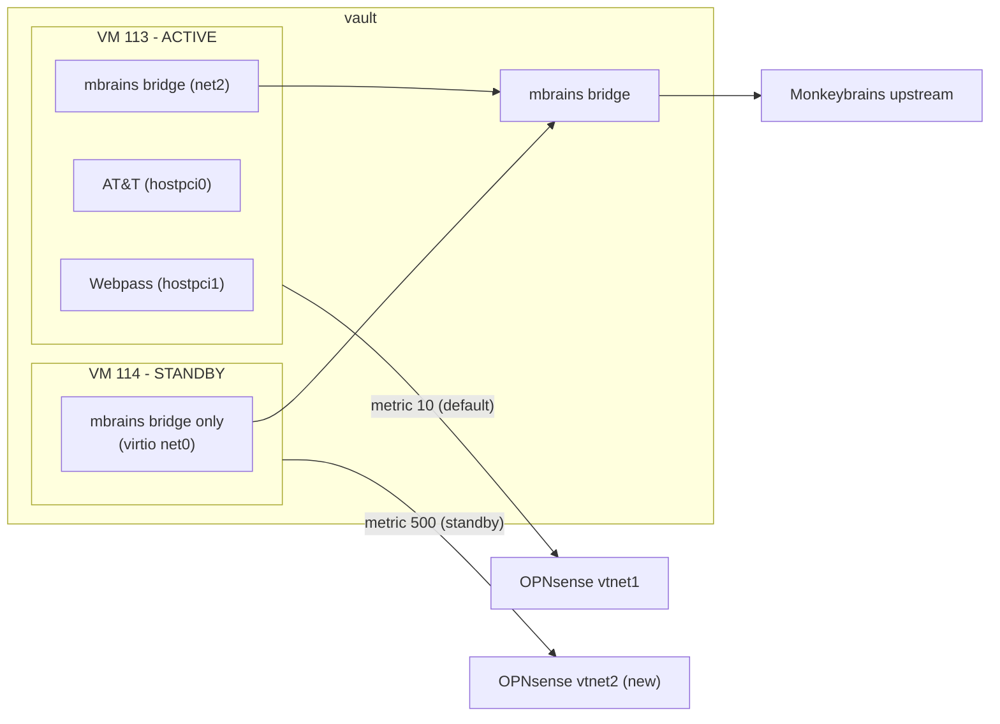

# MWAN HA Architecture

## Hard constraint

`hostpci0` (Webpass I226-V) and `hostpci1` (AT&T X710 VF) are physically bound to `vault`. They cannot be shared with a second VM, live-migrated, or used from `suburban`. True full-bandwidth HA is therefore not possible. What *is* possible is three complementary layers.

## Current state

- VM 113 has `net2: virtio=BC:24:11:E6:58:31,bridge=mbrains` -- the Monkeybrains virtio NIC is already there.
- `deploy-mwan.yml` already creates a `pre-deploy-*` snapshot before each deploy and writes `/var/run/mwan-last-deploy`.
- The watchdog (Go binary on vault, `mwan/go/cmd/mwan-watchdog/`) polls connectivity and rolls back if routing breaks within `CONNECTIVITY_TIMEOUT_SECONDS` (default 60s).
- Snapshots currently accumulate without pruning (5 snapshots, oldest from 2026-01-13).

---

## Layer A: Tighten the rollback loop

**Goal:** reduce the deploy-to-rollback window and prevent snapshot accumulation.

### A1: Post-deploy health gate in `deploy-mwan.yml`

Add a task at the end of the playbook that:
1. Waits up to 90s polling `ping6 2606:4700:4700::1111` from vault.
2. If it fails, immediately triggers `qm stop 113 && qm rollback 113 <snapshot> && qm start 113` from the delegate task.
3. Sets `failed_when: true` so the deploy is marked failed in Semaphore.

This fires *before* the watchdog even notices, cutting the outage to the 30-50s VM restart window rather than `CONNECTIVITY_TIMEOUT_SECONDS` + restart.

File to edit: [`ansible/playbooks/deploy-mwan.yml`](ansible/playbooks/deploy-mwan.yml)

### A2: Snapshot pruning

Add a task in `deploy-mwan.yml` (after creating the new snapshot) that prunes `pre-deploy-*` snapshots older than 3, keeping only the last 3. Uses `qm listsnapshot | awk` + `qm delsnapshot`.

### A3: Lower watchdog detection window

Update the watchdog TOML/env default for `CONNECTIVITY_TIMEOUT_SECONDS` from 60s to 30s. Bad deploys are the primary trigger, and 30s is enough to distinguish transient blip from routing failure.

File to edit: [`mwan/go/cmd/mwan-watchdog/config.go`](mwan/go/cmd/mwan-watchdog/config.go) -- the `defaultConnectivityTimeout` constant.

---

## Layer B: Monkeybrains-only standby VM (VM 114)

**Goal:** if VM 113 goes down entirely (watchdog can't recover it), OPNsense automatically fails over to VM 114 which has Monkeybrains connectivity. Connectivity is degraded (IPv4 CG-NAT, Monkeybrains `/56` PD for IPv6) but the network stays up.

### Architecture

### What VM 114 needs

- New Proxmox VM (OpenTofu `opentofu/` module) with only:
  - `net0: virtio, bridge=mbrains` (Monkeybrains)
  - `net1: virtio, bridge=mwanbr-standby` (new internal bridge to OPNsense, lower priority)
- Debian cloud-init image, same base as VM 113.
- Minimal config: only Monkeybrains DHCP/DHCPv6, NPT for the Monkeybrains `/56` PD, policy routing for `rt_tables` monkeybrains (300), default route to OPNsense.
- No AT&T, no Webpass, no 802.1X, no wpa_supplicant.
- DUID/MAC: Monkeybrains currently shares VM 113's DUID (`mwan_monkeybrains_duid`). VM 114 needs its own separate DUID registered with Monkeybrains -- or use the same MAC spoof if Monkeybrains doesn't care (worth testing).
- New Ansible playbook `deploy-mwan-standby.yml` that configures only the Monkeybrains WAN stack.

### OPNsense changes

- Add a second WAN interface (`vtnet2` or similar) connected to the new internal bridge.
- Set its gateway metric to 500 (vs. MWAN VM 113's metric 10).
- OPNsense's existing gateway failover will use VM 114 automatically when VM 113's gateway goes unhealthy.

### Watchdog awareness

The watchdog on vault should know about VM 114. When it triggers a rollback of VM 113, it can also signal VM 114 to stop advertising its default route (or simply leave OPNsense's metric system to handle it passively).

---

## Layer C: Staged config validation (future / optional)

Rather than deploy-then-rollback, validate config on a snapshot clone before cutting over. This is the most complex approach and likely only worth it if deploy frequency increases. Not planned for implementation now, documented for reference.

---

## Implementation order

1. **A2 snapshot pruning** -- no code changes, just add tasks to `deploy-mwan.yml`. Zero risk.
2. **A1 post-deploy health gate** -- adds a safety net to every future deploy. No new infrastructure.
3. **A3 lower watchdog timeout** -- one-line change to `config.go`, redeploy binary.
4. **B VM 114** -- new OpenTofu resource, new Ansible playbook, OPNsense gateway config. Requires OPNsense changes and testing Monkeybrains DUID behavior.
