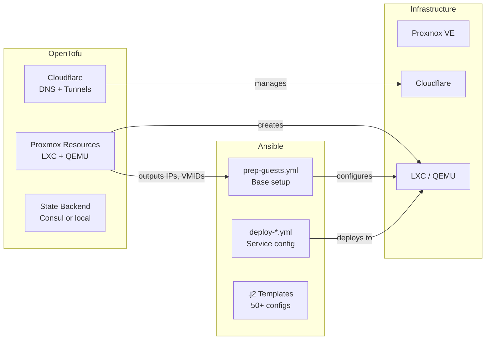

# OpenTofu Migration Evaluation

## Current Infrastructure Summary

The homelab is fully managed by Ansible + Rake tasks with no existing infrastructure-as-code tooling (Terraform/OpenTofu). The stack:

- **Hypervisor**: Proxmox VE (1 node: `vault`, 1 remote: `suburban`)
- **Containers**: ~12 LXC containers, 1 QEMU VM (mwan)
- **Networking**: IPv6-first, dual-stack where needed, KEA DHCPv4/v6, BIND DNS64
- **DNS**: Cloudflare (public), PowerDNS/BIND (internal), AdGuard Home (filtering)
- **Routing**: OPNsense firewall, Multi-WAN (AT&T + Webpass)
- **Services**: Traefik, Consul, SSHPiper, Grommunio, NanoMDM, Logstash, Minecraft
- **Secrets**: Ansible Vault (`inventory/group_vars/all/vault.yml`)
- **Source of truth**: `[service_mapping.yml](ansible/inventory/group_vars/all/service_mapping.yml)` (hostnames + IPs)

## Option A: OpenTofu for Provisioning Only (Recommended)

Replace resource creation (`create-ct.yml`, `create-vm.yml`, Cloudflare DNS) with OpenTofu. Keep Ansible for everything inside containers.

### What moves to OpenTofu


| Layer | Current | OpenTofu Provider | Feasibility |
| ----- | ------- | ----------------- | ----------- |


- **Proxmox LXC containers**: `[create-ct.yml](ansible/playbooks/create-ct.yml)` (654 lines of VMID lookup, MAC preservation, IP discovery, boot wait) -> `bpg/proxmox` provider (`proxmox_virtual_environment_container` resource). Mature, well-maintained. Handles disk, memory, cores, network, SSH keys, tags natively. **High feasibility**.
- **Proxmox QEMU VMs**: `[create-vm.yml](ansible/playbooks/create-vm.yml)` (cloud-init, PCI passthrough, multi-NIC) -> `bpg/proxmox` (`proxmox_virtual_environment_vm` resource). Supports cloud-init, PCI passthrough, multiple NICs. **High feasibility**.
- **Cloudflare DNS records**: Currently managed ad-hoc or via Ansible tasks -> `cloudflare/cloudflare` (`cloudflare_record` resource). **High feasibility**.
- **Cloudflare tunnels**: Currently deployed in `[deploy-proxy.yml](ansible/playbooks/deploy-proxy.yml)` -> `cloudflare/cloudflare` (`cloudflare_tunnel`, `cloudflare_tunnel_config`). **Medium feasibility** (tunnel token still needs to reach the container via Ansible).
- **Consul services**: Currently registered via Ansible tasks -> `hashicorp/consul` (`consul_service`, `consul_keys`). **Medium feasibility** (most service registration happens during configuration management, not provisioning).

### What stays in Ansible

- All `deploy-*.yml` playbooks (package installation, config file templating, systemd services)
- `prep-guests.yml` (base container setup: locale, SMTP, SSH hardening, Consul agent)
- All `.j2` templates (Traefik routes, AdGuard config, KEA config, BIND config, nftables, systemd-networkd)
- Secrets injection (vault variables into config files)
- SSH key deployment
- Service-specific logic (MWAN health checks, cert renewals, etc.)

### Advantages

- Clear separation: OpenTofu owns "does this thing exist?", Ansible owns "what's inside it?"
- OpenTofu state tracks resource drift (container deleted? shows in plan)
- Declarative resource definitions replace 654 lines of imperative VMID-lookup/MAC-preservation logic in `create-ct.yml`
- `service_mapping.yml` becomes a `locals` block or `.tfvars` file, still the single source of truth
- Ansible `community.proxmox` module stays for any configuration management tasks that need Proxmox API

### Disadvantages

- Two tools to learn/maintain instead of one
- State file storage needed (local or remote backend)
- Existing resources need `tofu import` (one-time effort)
- Orchestration gap: OpenTofu creates the container, then Ansible needs to configure it. Glue needed (e.g., Ansible reads OpenTofu output, or shared inventory)

## Option B: Full OpenTofu Replacement

Replace everything, including configuration management, with OpenTofu.

### What it would require

- `hashicorp/null_resource` + `remote-exec` provisioners for all config management (SSH into containers, run commands). This is explicitly discouraged by HashiCorp/OpenTofu docs.
- `hashicorp/template` provider for `.j2` templates (limited: no Jinja2, only Go templates). Would require rewriting all 50+ `.j2` templates to Go template syntax or using a pre-processing step.
- Custom `local-exec` provisioners wrapping shell scripts for complex orchestration (MWAN, cert management, etc.)
- Loss of Ansible's `community.general`, `community.proxmox`, and other collection modules
- No `ansible-vault` equivalent in OpenTofu (would need external secrets manager: Vault, SOPS, or env vars)

### Verdict: Not recommended

OpenTofu's provisioners are a bolted-on afterthought. Configuration management inside VMs/containers is Ansible's core strength. The 50+ Jinja2 templates, systemd service management, package installation, and multi-step orchestration workflows would degrade significantly. The MWAN playbook alone (`deploy-mwan.yml`) has hundreds of tasks managing systemd-networkd configs, nftables rules, wpa_supplicant, health check scripts, and networkd-dispatcher hooks. Replicating this in OpenTofu provisioners would be fragile and unmaintainable.

## Recommended Approach: Hybrid (Option A)




## Concrete Migration Plan

### Phase 0: Foundation

- Install OpenTofu on the Ansible controller (`3d06:bad:b01::107`) or locally
- Choose state backend: **Consul** (already running at `3d06:bad:b01::106`) or **local** with git-ignored state file
- Create directory structure:

```
opentofu/
  providers.tf        # bpg/proxmox, cloudflare/cloudflare
  variables.tf        # service_mapping equivalent
  terraform.tfvars    # actual values (git-ignored, secrets)
  outputs.tf          # IPs, VMIDs for Ansible consumption
  containers.tf       # LXC container definitions
  vms.tf              # QEMU VM definitions
  dns.tf              # Cloudflare DNS records
  backend.tf          # State backend config
```

### Phase 1: Proxmox LXC Containers

Convert `service_mapping.yml` to a `locals` block or `for_each` map:

```hcl
locals {
  containers = {
    debianct = {
      hostname = "debianct.home.goodkind.io"
      ipv6     = "3d06:bad:b01::100"
      vmid     = 100
      memory   = 512
      cores    = 1
      disk_gb  = 8
      tags     = ["lxc"]
    }
    # ... repeat for each container
  }
}

resource "proxmox_virtual_environment_container" "ct" {
  for_each  = local.containers
  node_name = "vault"
  vm_id     = each.value.vmid

  initialization {
    hostname = each.value.hostname
    ip_config {
      ipv6 {
        address = "${each.value.ipv6}/64"
        gateway = "3d06:bad:b01::1"
      }
    }
    user_account {
      keys = [trimspace(data.http.github_keys.response_body)]
    }
  }

  network_device {
    bridge = "vmbr0"
  }

  disk {
    datastore_id = "local-lvm"
    size          = each.value.disk_gb
  }

  memory { dedicated = each.value.memory }
  cpu    { cores     = each.value.cores }
  tags   = each.value.tags

  operating_system {
    template_file_id = "storage:vztmpl/ubuntu-24.04-standard_24.04-2_amd64.tar.zst"
    type             = "ubuntu"
  }

  started = true
}
```

Import existing containers:

```bash
tofu import 'proxmox_virtual_environment_container.ct["debianct"]' vault/lxc/100
tofu import 'proxmox_virtual_environment_container.ct["consul"]' vault/lxc/106
# ... for each container
```

### Phase 2: QEMU VM (mwan)

The MWAN VM has PCI passthrough, multiple NICs, and cloud-init. The `bpg/proxmox` provider supports all of these:

```hcl
resource "proxmox_virtual_environment_vm" "mwan" {
  node_name = "vault"
  vm_id     = 113
  name      = "mwan.home.goodkind.io"

  cpu    { cores = 2 }
  memory { dedicated = 2048 }

  disk {
    datastore_id = "local-lvm"
    size         = 16
    interface    = "scsi0"
  }

  network_device { bridge = "vmbr0" }  # mgmt
  network_device { bridge = "vmbr1" }  # WAN1
  network_device { bridge = "vmbr2" }  # WAN2

  hostpci {
    device = "hostpci0"
    id     = "0000:01:00.0"
  }

  initialization {
    ip_config {
      ipv6 { address = "3d06:bad:b01::113/64" }
    }
  }
}
```

### Phase 3: Cloudflare DNS

Create records for all services routed through Traefik:

```hcl
resource "cloudflare_record" "services" {
  for_each = {
    ansible  = "ansible.public.home.goodkind.io"
    vault    = "vault.public.home.goodkind.io"
    # ...
  }
  zone_id = var.cloudflare_zone_id
  name    = each.value
  type    = "AAAA"
  content = local.containers[each.key].ipv6
  proxied = true
}
```

### Phase 4: Ansible Integration

Two integration approaches:

**Option 4a: OpenTofu outputs -> Ansible dynamic inventory**

Create a script that reads `tofu output -json` and generates Ansible inventory. This replaces the Proxmox dynamic inventory plugin for provisioned resources.

**Option 4b: Keep Proxmox dynamic inventory (simpler)**

Keep `proxmox.yml` inventory plugin. OpenTofu creates the resources, Ansible discovers them via API as before. The `service_mapping.yml` stays as the shared reference. Deploy playbooks (`deploy-*.yml`) work unchanged.

Option 4b is recommended for migration since it requires zero Ansible changes.

### Phase 5: Secrets Migration

- Proxmox API token: move to `terraform.tfvars` (git-ignored) or env vars (`TF_VAR_proxmox_token_secret`)
- Cloudflare API token: same approach
- Container-internal secrets (SMTP2GO, Grommunio passwords, etc.): stay in Ansible Vault (these are configuration management concerns, not provisioning)

### Phase 6: Deprecation

Once OpenTofu manages all provisioning:

- Remove `create-ct.yml` and `create-vm.yml` playbooks
- Remove `setup-service-ct.yml` wrapper
- Update `deploy-*.yml` playbooks to drop their `import_playbook: setup-service-ct.yml` calls (containers already exist)
- Update Rakefiles to add `tofu plan` / `tofu apply` tasks

## Provider Versions and Compatibility

- `bpg/proxmox` >= 0.70.0: Full LXC + QEMU support, including `for_each`, tags, MAC pinning, cloud-init
- `cloudflare/cloudflare` >= 5.0: DNS records, tunnels, zones
- `hashicorp/consul` >= 2.21: State backend, optional service management
- OpenTofu >= 1.9: Stable, full provider registry compatibility

## Effort Estimate

- **Phase 0** (Foundation): 1-2 hours
- **Phase 1** (LXC containers): 3-4 hours (12 containers to define + import)
- **Phase 2** (MWAN VM): 1-2 hours
- **Phase 3** (Cloudflare DNS): 2-3 hours (record audit + import)
- **Phase 4** (Ansible integration): 1 hour (Option 4b is mostly no-op)
- **Phase 5** (Secrets): 30 min
- **Phase 6** (Cleanup): 1-2 hours

**Total: ~10-14 hours of focused work**, spread across multiple sessions.

## Risk Assessment

- **Low risk**: Cloudflare DNS migration (records are idempotent, easy to revert)
- **Medium risk**: Proxmox container import (if `tofu plan` shows unexpected diffs, a `tofu apply` could recreate a container. Use `lifecycle { prevent_destroy = true }` as a safeguard)
- **High risk**: MWAN VM (PCI passthrough, multi-NIC. Test with a throwaway VM first before importing the real one)

## Files That Change

- **New**: `opentofu/` directory with all `.tf` files
- **Modified**: Ansible `deploy-*.yml` playbooks (remove `setup-service-ct.yml` imports)
- **Deleted** (eventually): `create-ct.yml`, `create-vm.yml`, `setup-service-ct.yml`
- **Unchanged**: All `.j2` templates, `prep-guests.yml`, `service_mapping.yml` (becomes secondary reference), Rakefiles (add new tasks)
