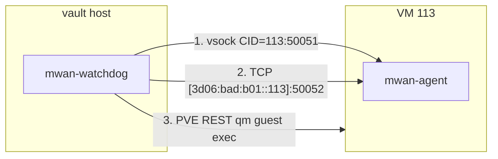

# Three-channel gRPC + per-channel health tracking

## Current state

The watchdog's `guestExec` in [ops.go](mwan/go/cmd/mwan-watchdog/ops.go) uses a serial fallback chain: vsock -> PVE REST. If vsock fails, it silently falls to REST with no visibility into which channel is healthy. The agent in [main.go](mwan/go/cmd/mwan-agent/main.go) only listens on vsock.

## Architecture



All three channels are probed on every cycle. Each result is logged with a `channel` attribute. The watchdog tracks per-channel health state independently so you can see signal like "vsock down, tcp ok, pve ok" in logs and emails.

## Changes

### 1. mwan-agent: add TCP listener alongside vsock

**File:** [mwan/go/cmd/mwan-agent/main.go](mwan/go/cmd/mwan-agent/main.go)

- Add `--tcp-addr` flag (default `[::]:50052`) -- listens on all interfaces including `enmgmt0`
- Create a single `grpc.Server`, register `agentServer` once
- Serve on both listeners concurrently:
  - `go grpcServer.Serve(vsockLis)` (may fail if no vsock device -- log and continue)
  - `go grpcServer.Serve(tcpLis)` (TCP on enmgmt0)
- If vsock listen fails, log a warning and run TCP-only (no crash)
- On signal, `GracefulStop()` shuts down both

### 2. watchdog: per-channel health tracking

**New file:** `mwan/go/cmd/mwan-watchdog/channels.go`

Define a `channelHealth` struct per transport:

```go
type channelName string
const (
    chanVsock channelName = "vsock"
    chanTCP   channelName = "tcp_mgmt"
    chanPVE   channelName = "pve_rest"
)

type channelHealth struct {
    name          channelName
    lastSuccess   time.Time
    lastFailure   time.Time
    lastError     string
    consecutiveFails int
    healthy       bool
}
```

And a `channelTracker` that the watchdog holds, with methods:
- `recordSuccess(ch channelName)` / `recordFailure(ch channelName, err error)`
- `summary() string` -- for inclusion in emails
- `logAll(log *slog.Logger)` -- logs per-channel status each cycle

### 3. watchdog ops.go: three-channel guestExec

**File:** [mwan/go/cmd/mwan-watchdog/ops.go](mwan/go/cmd/mwan-watchdog/ops.go)

- Add `tcpAddr string` to `realOps` and a new `tcpExec` method (gRPC over TCP to `[3d06:bad:b01::113]:50052`)
- The `tcpExec` method reuses the same gRPC client logic as `vsockExec` but dials TCP instead of vsock
- Refactor `guestExec` to try all three channels and record health for each:

```go
func (r *realOps) guestExec(ctx, vmid, args) (result, error) {
    // Try all three, use first success, record health for all.
    vsockRes, vsockErr := r.vsockExec(ctx, args...)
    r.tracker.record(chanVsock, vsockErr)
    if vsockErr == nil { return vsockRes, nil }

    tcpRes, tcpErr := r.tcpExec(ctx, args...)
    r.tracker.record(chanTCP, tcpErr)
    if tcpErr == nil { return tcpRes, nil }

    pveRes, pveErr := r.pveExec(ctx, vmid, args...)
    r.tracker.record(chanPVE, pveErr)
    return pveRes, pveErr
}
```

- On each watchdog heartbeat log, include `channelTracker.summary()` so you see per-channel health every 5 minutes

### 4. Config: add TCP address

**File:** [mwan/go/cmd/mwan-watchdog/config.go](mwan/go/cmd/mwan-watchdog/config.go)

- Add `MwanAgentTCPAddr string` to `config`, read from `MWAN_AGENT_TCP_ADDR` env var, default `[3d06:bad:b01::113]:50052`

**File:** [proxmox/config/mwan-watchdog.env.j2](proxmox/config/mwan-watchdog.env.j2)

- Add `MWAN_AGENT_TCP_ADDR=[3d06:bad:b01::113]:50052`

### 5. Email bodies: include per-channel health

All alert emails already call `buildSystemContext()`. Add a `channelTracker.summary()` section to every alert email body so you can see which channels were up/down at the time of the alert.

### 6. mwan-agent systemd service: update

**File:** [mwan/go/cmd/mwan-agent/mwan-agent.service](mwan/go/cmd/mwan-agent/mwan-agent.service)

- Add `--tcp-addr=[::]:50052` to `ExecStart`

### 7. Tests

- **channels_test.go**: test `channelTracker` record/summary logic
- **ops_test.go updates**: test three-channel fallback order, verify all channels get health recorded even when early one succeeds
- **mwan-agent main.go**: test TCP listener path via bufconn pattern

## What does NOT change

- The host-side `ping` (probeConnectivity) stays as-is -- it runs `ping`/`ping6` directly from vault, not through any channel
- VM lifecycle ops (`vmStop`, `vmStart`, `vmRollback`, `vmSnapshots`) stay as `qm` CLI -- these are host-side commands, not guest exec
- The rollback / diagnosis / alert logic in watchdog.go is untouched
