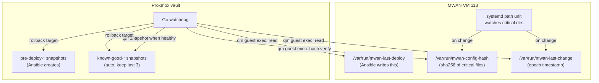

# Universal Change Detection and Auto-Snapshot for MWAN Watchdog

## Problem

The watchdog only knows about Ansible deploys (via `/var/run/mwan-last-deploy`). Manual scp, `scripts-updater` git pulls, direct edits, and runtime changes are invisible. And even if detected, there is no snapshot to roll back to unless Ansible created one.

## Architecture



## Component 1: VM-side file watcher

A systemd path unit on the MWAN VM watches critical directories for changes. When triggered, a companion oneshot service computes a config hash and writes the change marker.

### Files to create (deployed via Ansible to MWAN VM)

**`mwan/services/mwan-change-detect.path`** - systemd path unit watching:
- `/etc/mwan/mwan.env`
- `/etc/nftables.conf`
- `/etc/systemd/network/` (via `DirectoryNotEmpty` + `PathChanged`)
- `/usr/local/bin/update-routes.sh` (representative script)
- `/usr/local/bin/update-npt.sh`
- `/usr/local/bin/health-check.sh`
- `/etc/networkd-dispatcher/routable.d/`
- `/etc/wpa_supplicant/wpa_supplicant.conf`

systemd `PathChanged=` and `PathModified=` directives detect inode changes. Limitation: systemd path units can only watch individual files or directories, not recursive globs. We pick the most critical paths.

**`proxmox/mwan-change-detect/main.go`** - Go binary triggered by the path unit.

Compiled with `GOOS=linux GOARCH=amd64 go build -o mwan-change-detect .` and deployed to `/usr/local/bin/mwan-change-detect` on the MWAN VM.

Logic:
1. Walk a hardcoded list of critical file paths (same as the hash list below)
2. Compute `sha256` of each file's contents, then hash the concatenation
3. Write the composite hash to `/var/run/mwan-config-hash`
4. Write the current Unix epoch to `/var/run/mwan-last-change`
5. Exit 0

The binary is a single `main.go` file, standard library only (`crypto/sha256`, `os`, `fmt`, `path/filepath`, `time`, `strconv`). No external dependencies.

Critical files to hash:
- `/etc/mwan/mwan.env`
- `/etc/nftables.conf`
- `/etc/systemd/network/*` (glob)
- `/etc/iproute2/rt_tables`
- `/etc/sysctl.d/99-mwan.conf`
- `/etc/wpa_supplicant/wpa_supplicant.conf`
- `/etc/networkd-dispatcher/routable.d/*` (glob)

**`mwan/services/mwan-change-detect.service`** - companion oneshot:
```ini
[Unit]
Description=MWAN config change detector
[Service]
Type=oneshot
ExecStart=/usr/local/bin/mwan-change-detect
```

### Scripts not covered by path unit

`/opt/scripts/` changes via `scripts-updater` need a different hook. The simplest approach: add a `ExecStartPost` to the existing `scripts-updater.service` that touches `/var/run/mwan-last-change`. This catches git pull changes without watching the whole `/opt/scripts` tree.

## Component 2: Watchdog-side hash verification

Every N healthy cycles (e.g., every 10th iteration, roughly every 5 minutes), the Go watchdog runs a hash check via `qm guest exec`:

```bash
cat /var/run/mwan-config-hash
```

If the hash differs from the last-known value, the watchdog records a change event (equivalent to detecting a deploy). This is the belt-and-suspenders layer that catches anything the path unit might miss (e.g., the path unit is stopped, or a file outside the watched set was changed).

### Go changes in [proxmox/mwan-watchdog/main.go](proxmox/mwan-watchdog/main.go)

Add to the `watchdog` struct:
- `lastConfigHash string` - last known hash
- `hashCheckCounter int` - counts iterations since last hash check

Add a `checkConfigHash(ctx)` method that:
1. Reads `/var/run/mwan-config-hash` via `guestExec`
2. Compares to `lastConfigHash`
3. If different and `lastConfigHash` was not empty (first run), records a change by updating `changeDetectedAt`
4. Updates `lastConfigHash`

Add a `checkChangeMarker(ctx)` method that:
1. Reads `/var/run/mwan-last-change` via `guestExec`
2. If within the deploy window, treats it like a deploy

Modify the deploy-window check in the main loop to check BOTH:
- `/var/run/mwan-last-deploy` (Ansible deploys, existing)
- `/var/run/mwan-last-change` (any change, new)

The earlier of the two timestamps determines the deploy window start.

## Component 3: Automatic known-good snapshots

When the watchdog detects sustained healthy state (both IPv4 and IPv6 passing for `N` consecutive checks, e.g., 20 checks = ~10 minutes), it takes a `known-good-<timestamp>` snapshot of VM 113. It keeps the last 3 and prunes older ones.

### Go changes

Add to `config`:
- `SnapshotHealthyThreshold int` (default 20, ~10 min of healthy checks)
- `MaxKnownGoodSnapshots int` (default 3)

Add to `watchdog`:
- `consecutiveHealthy int` - counts consecutive healthy checks
- `lastSnapshotAt time.Time` - prevents taking snapshots too frequently

Add `sysOps` interface method:
- `vmSnapshot(ctx, vmid, name string) error` - calls `qm snapshot <vmid> <name>`

Add methods:
- `maybeSnapshot(ctx)` - if `consecutiveHealthy >= threshold` and enough time has passed since last snapshot, take one
- `pruneSnapshots(ctx)` - list `known-good-*` snapshots, delete all but the latest N

Modify rollback logic: when looking for a rollback target, check for `pre-deploy-*` first (Ansible-initiated), then fall back to `known-good-*` (any-change protection).

### Snapshot naming

- Ansible deploys: `pre-deploy-<timestamp>` (unchanged, created by `deploy-mwan.yml`)
- Auto healthy: `known-good-<timestamp>` (created by watchdog)

The watchdog's `findSnapshot` method becomes: "find latest `pre-deploy-*`, if none, find latest `known-good-*`."

## Component 4: Ansible deployment additions

Add to [ansible/playbooks/deploy-mwan.yml](ansible/playbooks/deploy-mwan.yml):
- Deploy pre-built `mwan-change-detect` Go binary to `/usr/local/bin/mwan-change-detect` (built locally, copied as a static binary)
- Deploy `mwan-change-detect.path` and `mwan-change-detect.service` to `/etc/systemd/system/`
- Enable and start `mwan-change-detect.path`
- Add `ExecStartPost=/usr/bin/date +%%s -o /var/run/mwan-last-change` to scripts-updater override (or a drop-in)

## Testing

### Unit tests (in `main_test.go`)
- `TestCheckChangeMarker`: mock guest exec returns epoch within/outside window
- `TestCheckConfigHash`: hash change detected, first-run ignored
- `TestMaybeSnapshot`: threshold met triggers snapshot, too recent skips
- `TestPruneSnapshots`: keeps last N, deletes older
- `TestFindSnapshot_PrefersPreDeploy`: pre-deploy-* chosen over known-good-*
- `TestFindSnapshot_FallsBackToKnownGood`: no pre-deploy, uses known-good

### Red-team scenario additions
- `config-drift`: Host pings fail, no Ansible deploy marker, but change marker present with known-good snapshot available. Expected: rollback to known-good.

### Dry-run verification
- Deploy the path unit to the VM
- Make a manual change (edit mwan.env, revert it)
- Verify `/var/run/mwan-last-change` updates
- Run Go watchdog in dry-run, verify it detects the change

## Edge cases to handle

- **Path unit not running**: The hash verification catches this (belt-and-suspenders).
- **VM rebooted**: `/var/run/` is tmpfs, so markers reset. The watchdog should handle missing markers gracefully (treat as "no recent change").
- **Rapid changes**: The path unit may fire multiple times. The oneshot service should be `RefuseManualStart=no` and the path unit should use `TriggerLimitBurst=` to rate-limit (e.g., max 1 trigger per 30s).
- **Snapshot during partial degradation**: Only snapshot when BOTH protocols are healthy. A partially degraded state should not be snapshotted as "known-good".
- **Disk space**: Snapshots consume disk. 3 known-good + N pre-deploy should be bounded. Add a `MaxTotalSnapshots` safeguard.
