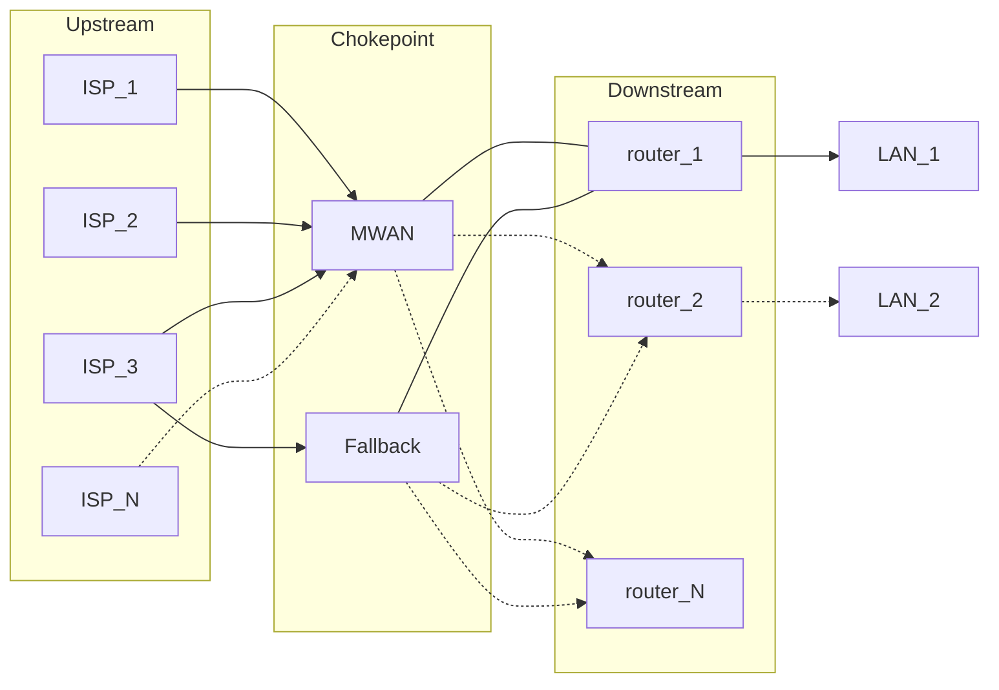
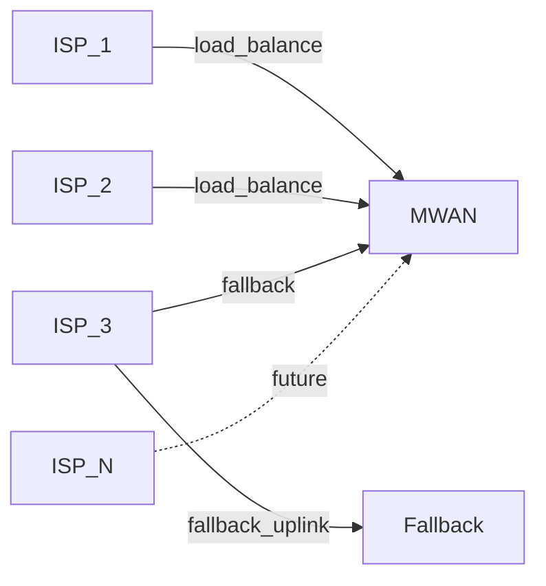
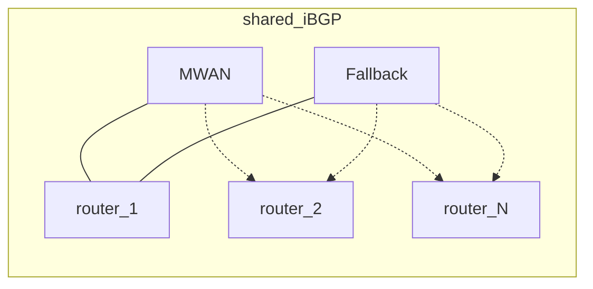

# MWAN

MWAN is the WAN chokepoint in front of the LAN router. The router sees one
upstream. MWAN owns multi-ISP load balancing, failover, and translation.

## Why it was built

OPNsense multi-WAN groups coupled WAN membership to firewall rules. A grouping
forced every rule a single-WAN setup had gotten for free. Outages looked like
random blackholes and were hard to diagnose.

MWAN exists so the LAN router keeps a single-WAN rule set. It started as
dual-gigabit load balancing for Webpass and AT&T. It now also does failover
and extra ISPs.

## What MWAN names

MWAN names three things:

- **Chokepoint.** The host that runs the main MWAN binary and terminates
  ISP links.
- **System.** That host plus a fallback speaker, a watchdog, and LAN
  routers that share BGP. A watchdog is a process that continuously
  monitors health and recovers the chokepoint when a change breaks
  connectivity.
- **Binary.** A single Go program that the chokepoint, the fallback, the
  watchdog host, and the LAN router run in different roles.

## Architecture

Traffic crosses three layers.

| Layer | Job |
| --- | --- |
| Upstream | ISP links terminate on the chokepoint |
| Chokepoint | The main MWAN binary load-balances, translates, and speaks BGP |
| Downstream | LAN routers peer over iBGP and announce the prefixes they route |

| Mark | Meaning |
| --- | --- |
| Solid line | A path in production today |
| Dashed line | A future ISP, or an extra LAN router |

## Major components

The chokepoint terminates the ISPs, marks new flows onto a WAN, and
translates addresses.

The fallback is a second BGP speaker. Its uplink is ISP-3. Only the
chokepoint load-balances.

The watchdog watches the chokepoint from outside it. A bad deploy rolls
the chokepoint back to a snapshot.

The LAN router, today one OPNsense box, never sees ISP membership. It
forwards to MWAN and announces the prefixes it routes.

The Go binary is one artifact. Each host runs the subcommands its role
needs.

## Worked example

Numbers below are documentation-only. IPv4 uses TEST-NET from
[RFC 5737](https://www.rfc-editor.org/rfc/rfc5737.html). IPv6 uses
[RFC 3849](https://www.rfc-editor.org/rfc/rfc3849.html). The ASN uses
[RFC 5398](https://www.rfc-editor.org/rfc/rfc5398.html). Names use
`example.test`. This is not production.

Prefix sizes in the tables are examples. Any prefix length works.

### Upstream

| Member | IPv4 | IPv6 PD | Role |
| --- | --- | --- | --- |
| ISP-1 | `192.0.2.0/29` | `2001:db8:1::/56` | Load-balance |
| ISP-2 | `198.51.100.0/29` | `2001:db8:2::/56` | Load-balance |
| ISP-3 | `203.0.113.0/29` | `2001:db8:3::/56` | Fallback, and the fallback speaker's uplink |
| ISP-N | `192.0.2.16/29` | `2001:db8:10::/56` | Future. Neither load-balance nor fallback |

ISP-3's prefix can renumber. Adding ISP-N is an inventory edit once the
[provider model](superpowers/wanconfig/spec.md) lands. No Go change. No
per-ISP template.

### Chokepoint

NPT replaces the internal prefix with the chosen WAN prefix. Remaining
bits stay. Prefix lengths need not match. If they differ, the shorter is
zero-extended first, per [RFC 6296](https://www.rfc-editor.org/rfc/rfc6296.html)
section 3.1. The longer prefix limits which subnets translate.

IPv4 is a 1:1 SNAT of each router's transit address onto the chosen WAN.

| Step | IPv4 address |
| --- | --- |
| Client | `10.0.0.10` |
| After `router-1` SNAT | `192.0.2.9` |
| After MWAN 1:1 SNAT onto ISP-2 | `198.51.100.1` |

### Downstream

The chokepoint, the fallback, and every router share one iBGP. ASN
`64496`. `router-1` prefers the primary speaker with local-pref.

Each router announces the prefixes it routes. Size is the router's
choice. MWAN installs what it hears and sends return traffic to that
router.

| Router | Announces | Example host | After NPT onto ISP-1 `2001:db8:1::/56` |
| --- | --- | --- | --- |
| `router-1` | `2001:db8:0:0::/64` | `2001:db8:0:0::10` | `2001:db8:1:0::10` |
| `router-1` | `2001:db8:0:4::/62` | `2001:db8:0:5::10` | `2001:db8:1:5::10` |
| `router-2` | `2001:db8:0:10::/60` | `2001:db8:0:10::10` | `2001:db8:1:10::10` |

`router-2` is future. Adding it is a new iBGP peer that announces what it
routes. No MWAN config change. See
[multiple downstream routers](superpowers/multirouter/spec.md).

| Host | Role |
| --- | --- |
| `gateway.example.test` | Chokepoint |
| `fallback.example.test` | Fallback speaker |
| `router-1.example.test` | LAN router |
| `router-2.example.test` | Future LAN router |
| `hypervisor.example.test` | Watchdog host |

### Flows

| Flow | What happens |
| --- | --- |
| Outbound IPv6 | Client `2001:db8:0:0::10` behind `router-1`. MWAN marks onto ISP-1. NPT rewrites to `2001:db8:1:0::10`. Return reverse-NPTs to `router-1`. |
| Outbound IPv4 | Client `10.0.0.10`. `router-1` SNATs to `192.0.2.9`. MWAN marks onto ISP-2 and 1:1 SNATs to `198.51.100.1`. |
| Inbound IPv6 | Packet to `2001:db8:1:0::10` on ISP-1. MWAN reverse-NPTs to `2001:db8:0:0::10` and forwards to `router-1`. The router does not know ISP-1 exists. |
| WAN health fallback | ISP-2 goes unhealthy. New flows use ISP-1. ISP-3 stays unused while a load-balance member is healthy. Both load-balance members unhealthy: new flows use ISP-3. |
| Speaker failover | The chokepoint is unhealthy. Its iBGP session drops, or the watchdog withdraws its prefixes. `router-1` still has the fallback in the same BGP. Fallback egresses on ISP-3. |
| Deploy rollback | A config push on `gateway.example.test` breaks connectivity. The watchdog rolls the chokepoint back to the latest `pre-deploy-*` snapshot, else a `known-good-*` snapshot. |
| Future ISP-N | The operator adds ISP-N with `192.0.2.16/29` and `2001:db8:10::/56`. `router-1` still sees one upstream. No router firewall change. |
| Second router | `router-2` joins iBGP and announces `2001:db8:0:10::/60`. Return traffic follows that announcement. MWAN config does not change. |

## By component

The chokepoint terminates ISPs and translates. The fallback is a second
BGP speaker. Only the chokepoint load-balances. The watchdog recovers the
chokepoint from outside it. The LAN router never sees ISP membership. The
binary is one artifact with many roles.

## By function

**Load balancing.** New flows get a mark. Policy routing plus 1:1 SNAT or
NPT sends them out ISP-1 or ISP-2.

**Failover.** The fallback stays in the same BGP. When the primary speaker
leaves, `router-1` keeps a path. WAN health fallback is separate: ISP-3
takes new flows only after both load-balance members are unhealthy.

**Future ISP.** Another WAN member on the chokepoint. It need not be
load-balance or fallback. The router firewall does not change.

**Health.** WAN state is healthy, unhealthy, or unknown.

**Rollback.** The watchdog host takes snapshots. A deploy that breaks
connectivity rolls back.

## Scalability

The guest kernel forwards each packet and applies nftables translation on
the way through.

When the chokepoint is a hypervisor guest, how a NIC is attached decides
whether the hypervisor copies the packet.

| Attach | Used on | What happens to a packet |
| --- | --- | --- |
| PCI passthrough | ISP-1 and ISP-2 | The guest talks to the physical NIC directly. |
| virtio | ISP-3, management, the router link, and every testbed WAN | The hypervisor implements a virtual NIC. Each packet crosses the host on the way into the guest. |

PCI passthrough gives the guest exclusive use of a physical WAN NIC. The
hypervisor cannot inspect or filter that NIC. Live migration is unavailable
while the NIC is attached.

A virtio NIC is a virtual device the hypervisor implements. Packets enter
the guest through the host, so the host can still see the traffic. The
virtio path copies each packet once on the way in.
