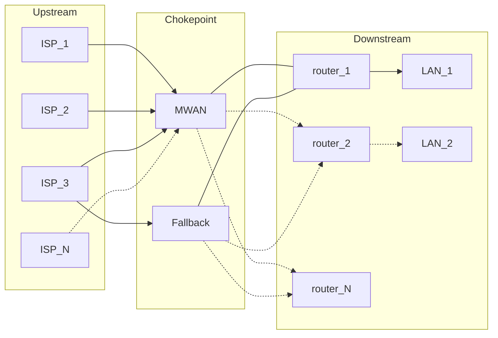
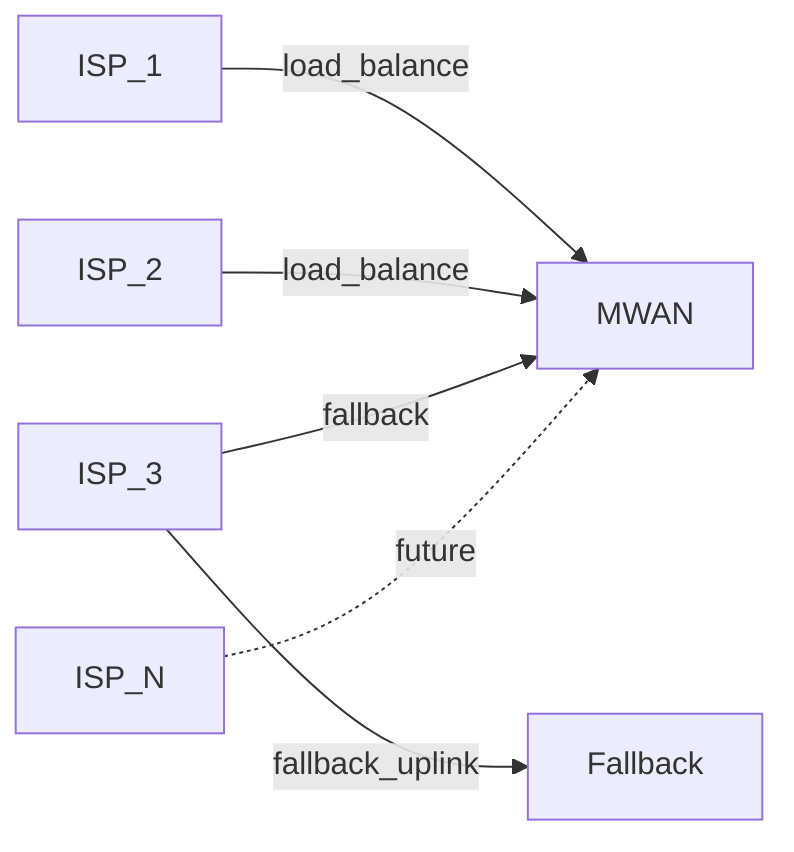
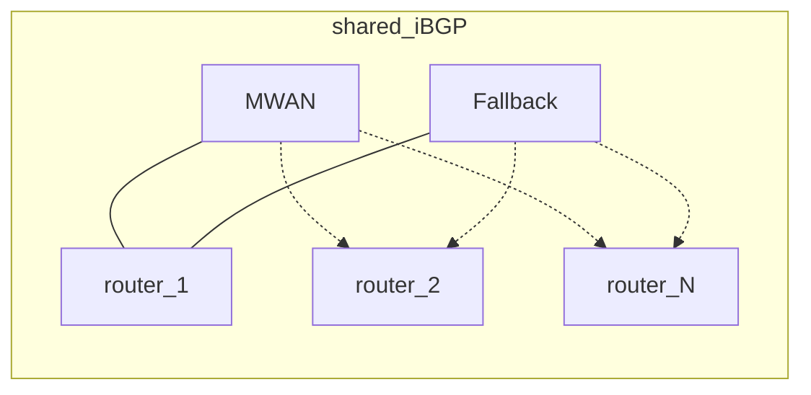
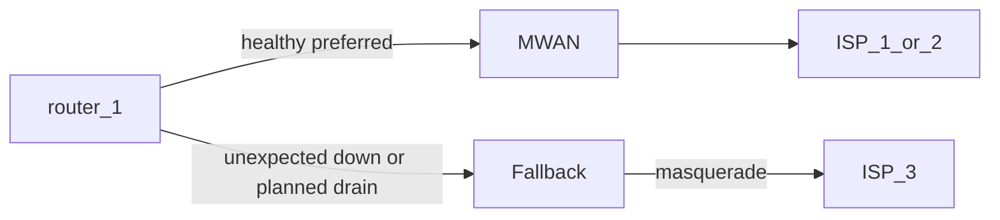
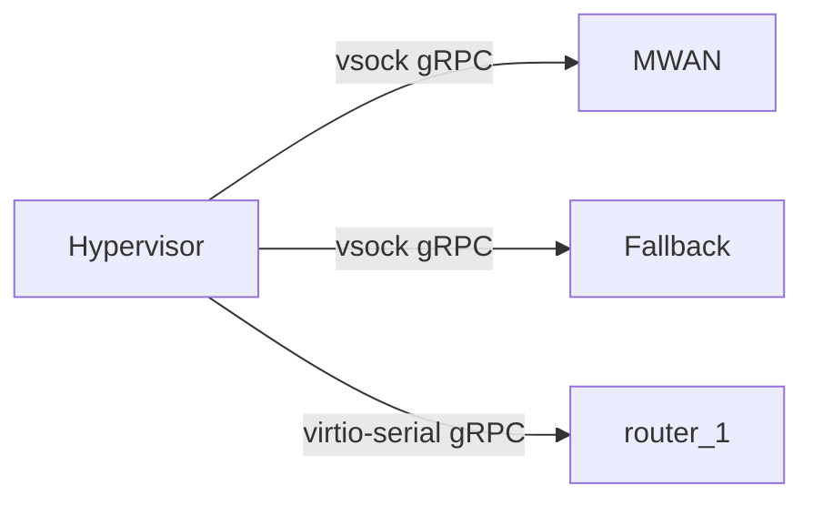

# MWAN

MWAN is the WAN chokepoint in front of the LAN router. The router sees one
upstream. MWAN owns multi-ISP load balancing, failover, and translation.

## Why it was built

OPNsense multi-WAN groups coupled WAN membership to firewall rules. A grouping
forced every rule a single-WAN setup had gotten for free. Outages looked like
random blackholes and were hard to diagnose.

MWAN exists so the LAN router keeps a single-WAN rule set. It started as
dual-gigabit load balancing for Webpass and AT&T. It now also does failover
and extra ISPs.

## What MWAN names

MWAN names three things:

- **Chokepoint:** The host that runs the main MWAN binary and terminates
  ISP links.
- **System:** That host plus a fallback speaker, a watchdog that recovers
  the chokepoint when a change breaks connectivity, and LAN routers that
  share BGP.
- **Binary:** A single monolith that the chokepoint, the fallback, the
  watchdog host, and the LAN router each run as the subcommands their
  role needs.

## Architecture

Traffic crosses three layers.

| Layer | Job |
| --- | --- |
| Upstream | ISP links terminate on the chokepoint |
| Chokepoint | The main MWAN binary load-balances, translates, and speaks BGP |
| Downstream | LAN routers and the LANs behind them. Routers peer over iBGP and announce the prefixes they route |

| Mark | Meaning |
| --- | --- |
| Solid line | A path in production today |
| Dashed line | A future ISP, or an extra LAN router |

## Major components

- **Chokepoint:** The host that terminates the ISPs, marks new flows onto
  a WAN, translates addresses, and is the only speaker that load-balances.
- **Fallback:** A second BGP speaker whose uplink is ISP-3.
- **Watchdog:** A process outside the chokepoint that rolls it back to a
  snapshot when a bad deploy breaks connectivity.
- **LAN router:** Today's OPNsense box, which never sees ISP membership,
  forwards to MWAN, and announces the prefixes it routes.
- **Binary:** A single monolith that each host runs as the subcommands its
  role needs.

## Worked example

Numbers below are documentation-only. IPv4 uses TEST-NET from
[RFC 5737](https://www.rfc-editor.org/rfc/rfc5737.html). IPv6 uses
[RFC 3849](https://www.rfc-editor.org/rfc/rfc3849.html). The ASN uses
[RFC 5398](https://www.rfc-editor.org/rfc/rfc5398.html). Names use
`example.test`. This is not production.

Prefix sizes in the tables are examples. Any prefix length works.

WAN documentation addresses stay in `2001:db8::/32`. Internal addresses use
a made-up GUA `3eef::/56` so the two sides stay distinct. That `/56` covers
the largest WAN delegation in the example.

### Upstream

| Member | IPv4 | IPv6 PD | Role |
| --- | --- | --- | --- |
| ISP-1 | `192.0.2.0/29` | `2001:db8:1::/56` | Load-balance |
| ISP-2 | `198.51.100.0/29` | `2001:db8:2::/56` | Load-balance |
| ISP-3 | `203.0.113.0/29` | `2001:db8:3::/56` | Health fallback on the chokepoint, and the failover speaker's uplink |
| ISP-N | `192.0.2.16/29` | `2001:db8:10::/56` | Future. Neither load-balance nor fallback |

The failover speaker masquerades out ISP-3. That ISP does not need to
match any prefix size. Failover does not serve inbound traffic.

Once the [provider model](superpowers/wanconfig/spec.md) lands, any ISP
can be added, removed, or renumbered. That is an inventory edit. No Go
change. No per-ISP template.

### Chokepoint

The chokepoint uses NPT and 1:1 SNAT. The failover speaker does not. It
masquerades, so the failover ISP's prefix size does not matter and inbound
is not served.

NPT replaces the internal prefix with the chosen WAN prefix. Remaining
bits stay. Prefix lengths need not match. If they differ, the shorter is
zero-extended first, per [RFC 6296](https://www.rfc-editor.org/rfc/rfc6296.html)
section 3.1. The longer prefix limits which subnets translate.

IPv4 is a 1:1 SNAT of each router's transit address onto the chosen WAN.

| Step | IPv4 address |
| --- | --- |
| Client | `10.0.0.10` |
| After `router-1` SNAT | `192.0.2.9` |
| After MWAN 1:1 SNAT onto ISP-2 | `198.51.100.1` |

### Downstream

The chokepoint, the fallback, and every router share one iBGP. ASN
`64496`. `router-1` prefers the primary speaker with local-pref.

Each router announces the prefixes it routes. Size is the router's
choice. MWAN installs what it hears and sends return traffic to that
router.

| Router | Announces | Example host | After NPT onto ISP-1 `2001:db8:1::/56` |
| --- | --- | --- | --- |
| `router-1` | `3eef::/64` | `3eef::10` | `2001:db8:1::10` |
| `router-1` | `3eef:0:0:4::/62` | `3eef:0:0:5::10` | `2001:db8:1:5::10` |
| `router-2` | `3eef:0:0:10::/60` | `3eef:0:0:10::10` | `2001:db8:1:10::10` |

`router-2` is future. Adding it is a new iBGP peer that announces what it
routes. No MWAN config change. See
[multiple downstream routers](superpowers/multirouter/spec.md).

| Host | Role |
| --- | --- |
| `gateway.example.test` | Chokepoint |
| `fallback.example.test` | Fallback speaker |
| `router-1.example.test` | LAN router |
| `router-2.example.test` | Future LAN router |
| `hypervisor.example.test` | Watchdog host |

### Failover

Failover reuses ordinary iBGP. The chokepoint and the fallback both
announce a default. Routers prefer the chokepoint with local-pref. When
that default goes away, they use the fallback. There is no extra failover
protocol.

The failover speaker masquerades out ISP-3, the safest NAT that still
forwards every outbound flow. That ISP does not need to match any prefix
size. Failover does not serve inbound traffic.

| Situation | What BGP does |
| --- | --- |
| Unexpected chokepoint down | The iBGP session drops. Routers take the fallback's default after the hold timer. |
| Planned maintenance | The chokepoint withdraws its default first. Routers take the fallback's default before the host goes away. |

### Flows

| Flow | What happens |
| --- | --- |
| Outbound IPv6 | Client `3eef::10` behind `router-1`. MWAN marks onto ISP-1. NPT rewrites to `2001:db8:1::10`. Return reverse-NPTs to `router-1`. |
| Outbound IPv4 | Client `10.0.0.10`. `router-1` SNATs to `192.0.2.9`. MWAN marks onto ISP-2 and 1:1 SNATs to `198.51.100.1`. |
| Inbound IPv6 | Packet to `2001:db8:1::10` on ISP-1. MWAN reverse-NPTs to `3eef::10` and forwards to `router-1`. The router does not know ISP-1 exists. |
| WAN health fallback | ISP-2 goes unhealthy. New flows use ISP-1. ISP-3 stays unused while a load-balance member is healthy. Both load-balance members unhealthy: new flows use ISP-3. |
| Speaker failover | The chokepoint's default goes away. `router-1` uses the fallback. Egress masquerades on ISP-3. No inbound. |
| Deploy rollback | A config push on `gateway.example.test` breaks connectivity. The watchdog rolls the chokepoint back to the latest `pre-deploy-*` snapshot, else a `known-good-*` snapshot. |
| Future ISP-N | The operator adds ISP-N with `192.0.2.16/29` and `2001:db8:10::/56`. `router-1` still sees one upstream. No router firewall change. |
| Second router | `router-2` joins iBGP and announces `3eef:0:0:10::/60`. Return traffic follows that announcement. MWAN config does not change. |

## Out-of-band management

The hypervisor reaches guests without using their IP stack.

vsock is a host-to-guest socket family (`AF_VSOCK`). It rides virtio and
does not use Ethernet or the guest IP stack. See
[vsock(7)](https://www.man7.org/linux/man-pages/man7/vsock.7.html).
Proxmox attaches it as a qemu virtio device on the guest. See
[QEMU/KVM Virtual Machines](https://pve.proxmox.com/pve-docs/chapter-qm.html).

- **Chokepoint and fallback:** Each speaker's agent serves gRPC over
  vsock. The hypervisor uses that channel for health, config state, and
  BGP withdraw, so those calls still work when the guest network is down.
- **OPNsense:** FreeBSD has no vsock to the host, so the path is
  virtio-serial, a paravirtual serial port. gRPC runs over that serial.
  A wedge-proof host path keeps the qemu chardev open so the guest never
  permanently wedges. See
  [wedge-proof serial](superpowers/wedgeproof/spec.md).

## By component

The chokepoint terminates ISPs and translates. The fallback is a second
BGP speaker. Only the chokepoint load-balances. The watchdog recovers the
chokepoint from outside it. The LAN router never sees ISP membership. The
binary is one artifact with many roles.

## By function

**Load balancing.** New flows get a mark. Policy routing plus 1:1 SNAT or
NPT sends them out ISP-1 or ISP-2.

**WAN health fallback.** ISP-3 takes new flows only after both load-balance
members are unhealthy. Speaker failover is ordinary iBGP. The failover
ISP masquerades, so prefix size does not matter and inbound is not served.

**Future ISP.** Another WAN member on the chokepoint. It need not be
load-balance or fallback. The router firewall does not change.

**Health.** WAN state is healthy, unhealthy, or unknown.

**Rollback.** The watchdog host takes snapshots. A deploy that breaks
connectivity rolls back.

## Scalability

The worry is whether a packet leaves the NIC fast path and gets processed
twice.

MWAN never pulls forwarded traffic into userspace. It only programs
routing tables, policy rules, and nftables. Any slower path is the
hypervisor attach, not the daemon.

**ISP passthrough (ISP-1, ISP-2).** No. The NIC DMAs into the chokepoint
guest. One kernel forwards and NATs. The hypervisor does not see the
packet. The guest keeps the NIC's offloads.

**ISP virtio (ISP-3, and every testbed WAN).** Yes. The host kernel
already received the packet on a bridged NIC. vhost-net then copies it
into the guest, and the guest kernel forwards and NATs it again. The
guest sees virtio-net, so it uses virtio offloads instead of the physical
NIC's DMA path. vhost-net keeps that copy in the host kernel. See
[Virtio-networking and vhost-net](https://www.redhat.com/en/blog/deep-dive-virtio-networking-and-vhost-net).

**Internal bridge (mwanbr).** Yes, on every LAN packet, even when the WAN
is passthrough. Client `3eef::10` behind `router-1` out ISP-1:

1. The router guest already forwarded the packet.
2. The host kernel copies it in, L2-forwards on the Linux bridge, and
   copies it out again.
3. The chokepoint guest forwards and NATs.
4. ISP-1 passthrough DMAs it to the wire.

The WAN passthrough does not undo steps 1 to 3. That is the re-done work
at 100 Gbit/s.

| Path | Leaves the NIC fast path? | Re-does work? |
| --- | --- | --- |
| ISP passthrough | No | No. One guest kernel. |
| ISP virtio | Yes. Host kernel, then virtio. | Yes. Host kernel, then guest kernel. |
| Internal bridge | Yes. Two virtio hops and a software bridge. | Yes. Router guest, host bridge, then chokepoint guest. |
