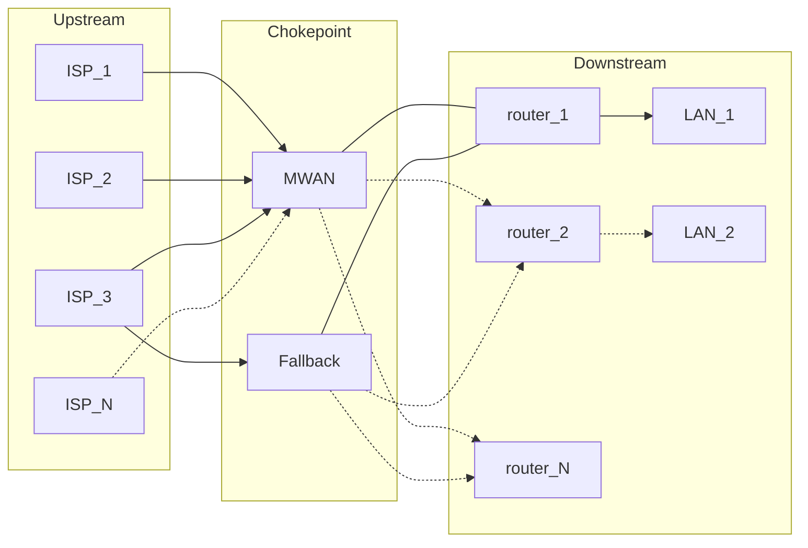
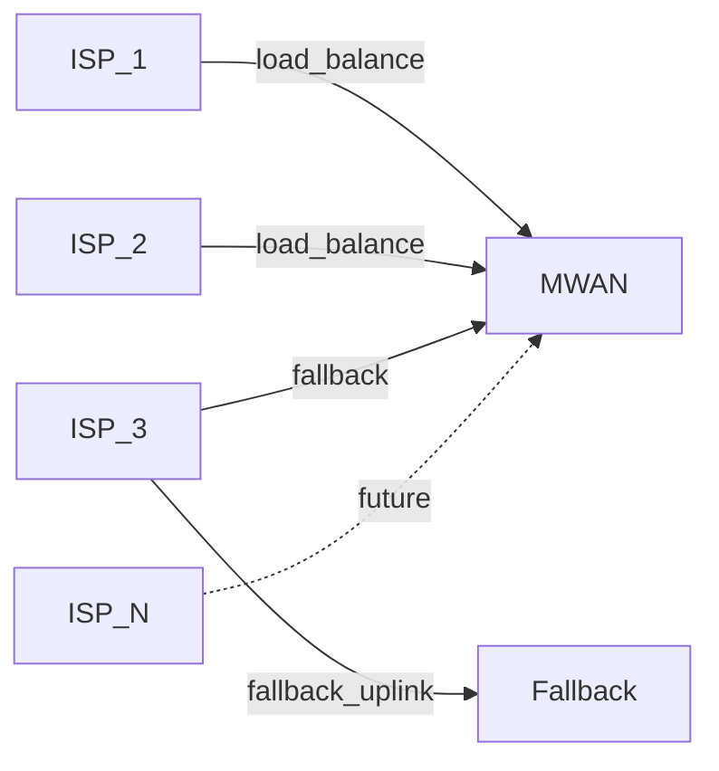
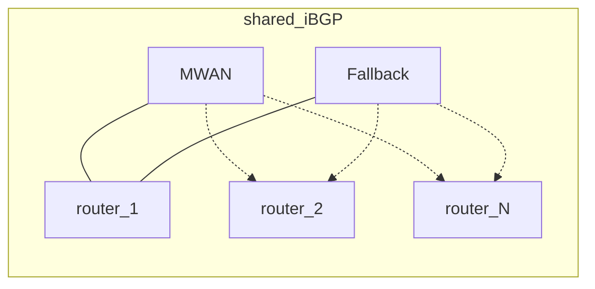
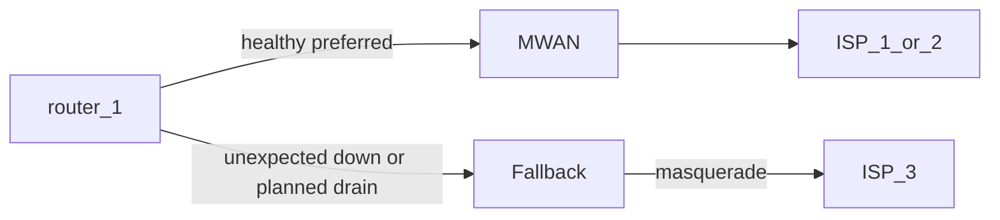
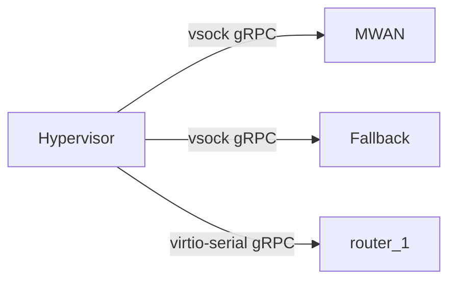

# MWAN

MWAN is the WAN chokepoint in front of the LAN router. The router sees one
upstream. MWAN owns multi-ISP load balancing, failover, and translation.

## Why it was built

OPNsense multi-WAN groups coupled WAN membership to firewall rules. A grouping
forced every rule a single-WAN setup had gotten for free. Outages looked like
random blackholes and were hard to diagnose.

MWAN exists so the LAN router keeps a single-WAN rule set. It started as
dual-gigabit load balancing for Webpass and AT&T. It now also does failover
and extra ISPs.

## What MWAN names

MWAN names three things:

- **Chokepoint:** The host that runs the main MWAN binary and terminates
  ISP links.
- **System:** That host plus a fallback speaker, a watchdog that recovers
  the chokepoint when a change breaks connectivity, and LAN routers that
  share BGP.
- **Binary:** A single monolith that the chokepoint, the fallback, the
  watchdog host, and the LAN router each run as the subcommands their
  role needs.

## Architecture

Traffic crosses three layers.

| Layer | Job |
| --- | --- |
| Upstream | ISP links terminate on the chokepoint |
| Chokepoint | The main MWAN binary load-balances, translates, and speaks BGP |
| Downstream | LAN routers and the LANs behind them. Routers peer over iBGP and announce the prefixes they route |

| Mark | Meaning |
| --- | --- |
| Solid line | A path in production today |
| Dashed line | A future ISP, or an extra LAN router |

## Major components

- **Chokepoint:** The host that terminates the ISPs, marks new flows onto
  a WAN, translates addresses, and is the only speaker that load-balances.
- **Fallback:** A second BGP speaker whose uplink is ISP-3.
- **Watchdog:** A process outside the chokepoint that rolls it back to a
  snapshot when a bad deploy breaks connectivity.
- **LAN router:** Today's OPNsense box, which never sees ISP membership,
  forwards to MWAN, and announces the prefixes it routes.
- **Binary:** A single monolith that each host runs as the subcommands its
  role needs.

## Worked example

Numbers below are documentation-only and do not reflect :
- IPv4 uses TEST-NET from
[RFC 5737](https://www.rfc-editor.org/rfc/rfc5737.html).
- IPv6 uses
[RFC 3849](https://www.rfc-editor.org/rfc/rfc3849.html).
- The ASN uses
- [RFC 5398](https://www.rfc-editor.org/rfc/rfc5398.html). Names use
`example.test`.

All valid prefix lengths are supported and prefix sizes in the tables are only examples.

Internal addresses use `fd06::/56` for simplicity.

### Upstream

| Member | IPv4 | IPv6 PD | Role |
| --- | --- | --- | --- |
| ISP-1 | `192.0.2.0/29` | `2001:db8:1::/56` | Load-balance |
| ISP-2 | `198.51.100.0/29` | `2001:db8:2::/56` | Load-balance |
| ISP-3 | `203.0.113.0/29` | `2001:db8:3::/56` | Health fallback on the chokepoint, and the failover speaker's uplink |
| ISP-N | `192.0.2.16/29` | `2001:db8:10::/56` | Future. Neither load-balance nor fallback |

The failover speaker masquerades outbound traffic onto ISP-3 instead of
translating prefixes in both directions. That NAT hides every internal
address behind the failover ISP's own address. Prefix size does not
matter for the failover ISP. Failover only forwards outbound flows
and does not accept inbound traffic.

An operator adds an ISP at the chokepoint, not at the LAN router. The LAN
router never sees ISP membership, so its firewall does not change.

### Chokepoint

The chokepoint uses NPT and 1:1 SNAT on load-balanced flows. The failover
speaker masquerades instead of using NPT or 1:1 SNAT.

NPT replaces the internal prefix with the chosen WAN prefix and leaves
the rest of the address alone. The two prefixes can be different lengths.
When they differ, the shorter prefix is zero-extended first, per
[RFC 6296](https://www.rfc-editor.org/rfc/rfc6296.html) section 3.1. The
longer prefix then limits which subnets translate.

IPv4 is a 1:1 SNAT of each router's transit address onto the chosen WAN.

| Step | IPv4 address |
| --- | --- |
| Client | `10.0.0.10` |
| After `router-1` SNAT | `192.0.2.9` |
| After MWAN 1:1 SNAT onto ISP-2 | `198.51.100.1` |

### Downstream

The chokepoint, the fallback, and every router share one iBGP. ASN
`64496`. `router-1` prefers the primary speaker with local-pref.

Each router announces the prefixes it routes. Size is the router's
choice. MWAN installs what it hears and sends return traffic to that
router.

| Router | Announces | Example host | After NPT onto ISP-1 `2001:db8:1::/56` |
| --- | --- | --- | --- |
| `router-1` | `fd06::/64` | `fd06::10` | `2001:db8:1::10` |
| `router-1` | `fd06:0:0:4::/62` | `fd06:0:0:5::10` | `2001:db8:1:5::10` |
| `router-2` | `fd06:0:0:10::/60` | `fd06:0:0:10::10` | `2001:db8:1:10::10` |

`router-2` is future. Adding it is a new iBGP peer that announces what it
routes. No MWAN config change. See
[multiple downstream routers](superpowers/multirouter/spec.md).

| Host | Role |
| --- | --- |
| `gateway.example.test` | Chokepoint |
| `fallback.example.test` | Fallback speaker |
| `router-1.example.test` | LAN router |
| `router-2.example.test` | Future LAN router |
| `hypervisor.example.test` | Watchdog host |

### Failover

Failover reuses ordinary iBGP. The chokepoint and the fallback both
announce a default. Routers prefer the chokepoint with local-pref. When
that default goes away, they use the fallback. There is no extra failover
protocol.

The failover speaker masquerades outbound traffic onto ISP-3, and that
NAT still forwards every outbound flow. Prefix size does not matter for
the failover ISP. Failover does not accept inbound traffic through the
failover ISP.

| Situation | What BGP does |
| --- | --- |
| Unexpected chokepoint down | The iBGP session drops. Routers take the fallback's default after the hold timer. |
| Planned maintenance | The chokepoint withdraws its default first. Routers take the fallback's default before the host goes away. |

### Flows

| Flow | What happens |
| --- | --- |
| Outbound IPv6 | A client at `fd06::10` sits behind `router-1` and sends the packet toward MWAN. MWAN marks that new flow onto ISP-1, and NPT rewrites the source to `2001:db8:1::10`. Return traffic reverse-NPTs the destination and returns to `router-1`. |
| Outbound IPv4 | A client at `10.0.0.10` is SNATed by `router-1` to `192.0.2.9`. MWAN then marks the flow onto ISP-2 and applies 1:1 SNAT to `198.51.100.1`. |
| Inbound IPv6 | A packet addressed to `2001:db8:1::10` arrives on ISP-1. MWAN reverse-NPTs the destination to `fd06::10` and forwards the packet to `router-1`. The router does not know that ISP-1 exists. |
| WAN health fallback | When ISP-2 becomes unhealthy, new flows move to ISP-1 rather than to ISP-3. ISP-3 stays unused while any load-balance member remains healthy. New flows use ISP-3 only after both load-balance members are unhealthy. |
| Speaker failover | When the chokepoint's default route goes away, `router-1` uses the fallback speaker. Egress from that speaker masquerades onto ISP-3. The fallback path does not accept inbound traffic. |
| Deploy rollback | If a config push on `gateway.example.test` breaks connectivity, the watchdog restores the chokepoint from a snapshot. It prefers the latest `pre-deploy-*` snapshot, and it uses a `known-good-*` snapshot when none of those exist. |
| Future ISP-N | The operator adds ISP-N with `192.0.2.16/29` and `2001:db8:10::/56`. `router-1` still sees one upstream, so the router firewall does not change. |
| Second router | `router-2` joins iBGP and announces `fd06:0:0:10::/60`. Return traffic follows that announcement, and MWAN configuration does not change. |

## Out-of-band management

The hypervisor reaches guests without using their IP stack.

vsock is a host-to-guest socket family (`AF_VSOCK`). It rides virtio and
does not use Ethernet or the guest IP stack. See
[vsock(7)](https://www.man7.org/linux/man-pages/man7/vsock.7.html).
Proxmox attaches it as a qemu virtio device on the guest. See
[QEMU/KVM Virtual Machines](https://pve.proxmox.com/pve-docs/chapter-qm.html).

- **Chokepoint and fallback:** Each speaker's agent serves gRPC over
  vsock. The hypervisor uses that channel for health, config state, and
  BGP withdraw, so those calls still work when the guest network is down.
- **OPNsense:** FreeBSD guests cannot use vsock to the hypervisor, so
  OPNsense talks over virtio-serial instead. Virtio-serial is a
  paravirtual serial port that carries gRPC between the host and the
  guest. A wedge-proof host path keeps the qemu character device open so
  the guest cannot wedge that channel permanently. See
  [wedge-proof serial](superpowers/wedgeproof/spec.md).

## By component

Traffic hits the chokepoint first, where the main MWAN binary terminates
the ISP links, translates addresses, and load-balances new flows. A
second BGP speaker on ISP-3 is the fallback, and it does not load-balance.
A watchdog outside the chokepoint restores that host when a change breaks
connectivity. The LAN router never sees which ISPs exist, so it forwards
to MWAN as one upstream. Each of those hosts runs one binary as the
subcommands its role needs.

## By function

**Load balancing:** New flows receive a mark. Policy routing plus 1:1 SNAT
or NPT sends them out ISP-1 or ISP-2.

**WAN health fallback:** New flows use ISP-3 only after both load-balance
members are unhealthy. On speaker failover, the LAN routers switch to the
fallback speaker over ordinary iBGP. The failover ISP masquerades
outbound traffic, so prefix size does not matter. Failover does not
accept inbound traffic through the failover ISP.

**Future ISP:** The operator adds another WAN member at the chokepoint.
That member can be neither a load-balance member nor a fallback member.
The LAN router firewall does not change when that member is added.

**Health:** WAN state is healthy, unhealthy, or unknown.

**Rollback:** The watchdog host takes snapshots. A deploy that breaks
connectivity rolls back.

## Scalability

When the LAN router and the chokepoint run as separate guests on a
virtual NIC, the hypervisor copies each packet on that hop.

MWAN programs routes, policy rules, and nftables in the guest kernel, so
forwarded packets stay inside those kernels. The daemon does not copy
packet bytes in userspace.

**Host copies:** The hypervisor copies each packet between guests that
share a virtual NIC on the same host. Giving the physical NIC to one
guest skips that copy on that hop.

A LAN client on the worked-example path ran a public speedtest on
16 August 2026. Upload reached 1782 Mbit/s, and download reached
693 Mbit/s. Hypervisor copy threads peaked at 1.11 cores on a 12-core
host. Faster links were not measured, so this page has no figure for
them.

### Sample scenarios

The WAN hop and the router-to-chokepoint hop are independent attach
choices.

**Direct WAN:** The ISP network interface is given to the chokepoint, so
the NIC places packets directly into that guest's kernel. The WAN hop
has no hypervisor copy of those packets.

**Virtual WAN:** The ISP network interface stays attached to the host, so
the host copies each packet into the chokepoint guest. The WAN hop pays a
host copy for every packet.

**Two guests on one host bridge:** The router and the chokepoint run as
separate guests. Every LAN packet to the chokepoint is copied into the
host, forwarded on the bridge, and copied out to the chokepoint.

| Scenario | Where host copies run |
| --- | --- |
| Direct WAN | None on the WAN hop |
| Virtual WAN | On the WAN hop |
| Two guests on one host bridge | On every LAN packet to the chokepoint |

In the worked example, ISP-1 and ISP-2 use Direct WAN, and ISP-3 uses
Virtual WAN. Every LAN packet to the chokepoint also takes the two-guest
bridge.

Giving the ISP NIC to the chokepoint removes host copies from the WAN
hop. Host copies remain on the two-guest hop for as long as the router
and the chokepoint stay separate guests on one bridge.

### Worked example

Client `fd06::10` sits behind `router-1` and leaves on ISP-1. ISP-1 uses
Direct WAN, so the WAN hop has no host copy. The packet crosses the
two-guest bridge and then DMAs out ISP-1.

On 16 August 2026, a LAN client ran a public speedtest on this path and
reached 693 Mbit/s down and 1782 Mbit/s up. The two-guest bridge cost
1.11 CPU cores at the upload peak. That is the copy work the hypervisor
would not do if the router and the chokepoint shared one kernel.

The table compares CPU on the 12-core host before the test and at the
upload peak. Copy threads are the hypervisor threads that move packets
between the two guests. Guest forwarding is the CPU each guest kernel
spent on routing and NAT.

| Measure | Before the test | At the upload peak |
| --- | --- | --- |
| Copy threads, router guest | 0.01 cores | 0.59 cores |
| Copy threads, chokepoint guest | 0.01 cores | 0.52 cores |
| Copy threads, both guests | 0.02 cores | 1.11 cores, about 9% of the host |
| Guest forwarding, router guest | not measured | 4.54 cores |
| Guest forwarding, chokepoint guest | not measured | 2.01 cores |

At 1782 Mbit/s the copies cost about one core, and the guests' own
forwarding cost about six and a half cores. The copies were about 15% of
the CPU the traffic used. Faster links were not measured, so this page
does not state a cost at 10 Gbit/s or above.

Conclusion: A future optimization could move the chokepoint into an LXC th
