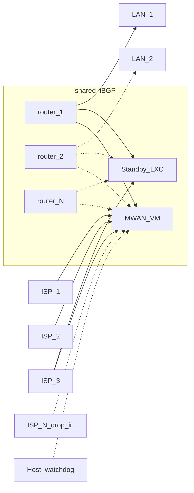

# MWAN

MWAN is the WAN chokepoint in front of the LAN router. The router sees one
upstream. MWAN owns multi-ISP load balancing, failover, and translation.

## Why it was built

OPNsense multi-WAN groups coupled WAN membership to firewall rules. A grouping
forced every rule a single-WAN setup had gotten for free. Outages looked like
random blackholes and were hard to diagnose.

MWAN exists so the LAN router keeps a single-WAN rule set. It started as
dual-gigabit load balancing for Webpass and AT&T. It now also does failover
and extra ISPs.

## What MWAN names

MWAN names three things:

- **WAN virtual machine.** A guest that terminates ISP links and is the
  chokepoint.
- **System.** A WAN virtual machine plus a standby speaker, a watchdog, and
  LAN routers that share BGP. A watchdog is a process that continuously
  monitors health and recovers the virtual machine when a change breaks
  connectivity.
- **Binary.** A single Go program that the virtual machine, the standby, the
  hypervisor, and the LAN router run in different roles.

## Architecture

| Mark | Meaning |
| --- | --- |
| Solid line | A path in production today |
| Dashed line | A future drop-in ISP, or an extra LAN router |
| Primary VM | Terminates every WAN |
| ISP-1, ISP-2 | Load-balance members |
| ISP-3 | Health fallback, and the standby uplink |
| Shared iBGP | The virtual machine, the standby, and every router share one session |

## Major components

The MWAN VM terminates the ISPs, marks new flows onto a WAN, and translates
addresses. It is the chokepoint.

The standby LXC is a second BGP speaker. Its uplink is ISP-3. Only the
primary VM load-balances.

The hypervisor watchdog watches the VM from outside it. A bad deploy rolls
the VM back to a snapshot.

The LAN router, today one OPNsense box, never sees ISP membership. It
forwards to MWAN and announces its own LAN prefix.

The Go binary is one artifact. Each host runs the subcommands its role
needs.

## Worked example

Numbers below are documentation-only. IPv4 uses TEST-NET from
[RFC 5737](https://www.rfc-editor.org/rfc/rfc5737.html). IPv6 uses
[RFC 3849](https://www.rfc-editor.org/rfc/rfc3849.html). The ASN uses
[RFC 5398](https://www.rfc-editor.org/rfc/rfc5398.html). Names use
`example.test`. This is not production.

The general IPv6 unit is `/56`. The general IPv4 unit is `/29`. NPT maps the
whole internal `/56` onto the chosen WAN `/56`. Each WAN public IPv4 is a
`/29`. Transit IPv4 is one `/29` that every router source-NATs onto.

Today there is one router and one `/60`, and that `/60` is fully allocated.
The example widens the internal block to a `/56` so each router can take a
`/60` slice and announce it.

### Current members

- **ISP-1** (today Webpass): PCI passthrough, `192.0.2.0/29`, PD
  `2001:db8:1::/56`, interface `enisp1`. Load-balance member.
- **ISP-2** (today AT&T): PCI VF passthrough, 802.1X then VLAN `100` on
  `enisp2.100`, `198.51.100.0/29`, PD `2001:db8:2::/56`. Load-balance member.
  Untagged `enisp2` is ONT management only.
- **ISP-3** (today Monkeybrains): virtio, `203.0.113.0/29`, PD
  `2001:db8:3::/56` that can renumber. Health fallback on the primary. Also
  the standby LXC uplink.

### Future drop-in

**ISP-N** is another member with a `/29` and a `/56`, example `192.0.2.16/29`
and `2001:db8:10::/56`. Adding it is an inventory edit once the
[provider model](superpowers/wanconfig/spec.md) lands. No Go change. No
per-ISP template.

### Internal space and BGP

- **Internal IPv6:** `2001:db8:0::/56`. Current analogue: only `router-1`,
  announcing `2001:db8:0:0::/60`. That one allocated slice matches today's
  single full `/60`. `router-2` would announce `2001:db8:0:10::/60`.
  `router-N` would announce the next `/60`. NPT still translates the whole
  `/56` per WAN. Each slice maps unchanged.
- **Transit IPv4:** `192.0.2.8/29`. `router-1` SNATs LAN RFC1918 (example
  `10.0.0.0/24`) to `192.0.2.9`. `router-2` would SNAT to `192.0.2.10`. MWAN
  1:1 SNATs that transit `/29` onto the chosen WAN `/29`.
- **Hosts:** `gateway.example.test`, `standby.example.test`,
  `router-1.example.test`, `hypervisor.example.test`.
  `router-2.example.test` is the extension slot.
- **Shared iBGP:** ASN `64496`. The MWAN VM, the standby, and every router
  are in the same BGP. `router-1` prefers the primary speaker with
  local-pref.
- **More routers:** `router-2` through `router-N` join that same BGP. Each
  announces its own `/60` of the `/56`. No MWAN config change. See
  [multiple downstream routers](superpowers/multirouter/spec.md). Extra
  routers are dashed on the diagram.

### Flows

Same addresses every time. Future flows say so.

**Outbound IPv6, load-balanced (current).** Client `2001:db8:0:0::10` behind
`router-1`. `router-1` forwards to MWAN. MWAN marks the new flow onto ISP-1.
NPT rewrites the `/56` to `2001:db8:1:0::10`. Return traffic reverse-NPTs
back to `router-1`.

**Outbound IPv4, 1:1 SNAT (current).** Client `10.0.0.10` behind `router-1`.
`router-1` SNATs to transit `192.0.2.9`. MWAN marks onto ISP-2 and 1:1 SNATs
onto `198.51.100.1`. Return DNAT reverses both steps.

**Inbound IPv6 (current).** Packet to `2001:db8:1:0::10` on ISP-1. MWAN
reverse-NPTs to `2001:db8:0:0::10` and forwards to `router-1`. `router-1`
still does not know ISP-1 exists.

**WAN health fallback (current).** ISP-2 goes unhealthy. New flows use ISP-1
only. ISP-3 stays unused while a load-balance member is healthy. Both ISP-1
and ISP-2 unhealthy: new flows use ISP-3.

**Speaker failover (current).** Primary MWAN is unhealthy. Its iBGP session
drops, or the watchdog withdraws its prefixes. `router-1` still has the
standby in the same BGP and keeps forwarding. Standby egresses on ISP-3.

**Deploy rollback (current).** A config push on `gateway.example.test` breaks
connectivity. The hypervisor watchdog rolls the VM back to the latest
`pre-deploy-*` snapshot, else a `known-good-*` snapshot.

**Drop-in ISP-N (future).** The operator adds ISP-N as a member with
`192.0.2.16/29` and `2001:db8:10::/56`. After deploy, new flows can mark onto
ISP-N. `router-1` still sees one upstream. No router firewall change.

**Second router (future).** `router-2` joins the shared iBGP and announces
its slice `2001:db8:0:10::/60`. Client `2001:db8:0:10::10` browses. MWAN NPT
still maps the whole `/56`. Return traffic follows the announced `/60` to
`router-2`. MWAN config does not change.

## By component

The VM terminates ISPs and translates. The standby is a BGP peer, not a
second load balancer. The watchdog recovers the VM from outside it. The LAN
router never sees ISP membership. The binary is one artifact with many roles.

## By function

**Load balancing.** New flows get a mark. Policy routing plus 1:1 SNAT or
NPT sends them out ISP-1 or ISP-2.

**Failover.** The standby stays in the same BGP. When the primary speaker
leaves, `router-1` keeps a path. WAN health fallback is separate: ISP-3
takes new flows only after both load-balance members are unhealthy.

**Drop-in ISP.** Another WAN member on the chokepoint. The router firewall
does not change.

**Health.** WAN state is healthy, unhealthy, or unknown.

**Rollback.** The host takes snapshots. A deploy that breaks connectivity
rolls back.

## Scalability

The guest kernel forwards each packet and applies nftables translation on
the way through.

How a NIC is attached to the guest decides whether the hypervisor copies
the packet.

| Attach | Used on | What happens to a packet |
| --- | --- | --- |
| PCI passthrough | ISP-1 and ISP-2 | The guest talks to the physical NIC directly. |
| virtio | ISP-3, management, the router link, and every testbed WAN | The hypervisor implements a virtual NIC. Each packet crosses the host on the way into the guest. |

PCI passthrough gives the guest exclusive use of a physical WAN NIC. The
hypervisor cannot inspect or filter that NIC. Live migration is unavailable
while the NIC is attached.

A virtio NIC is a virtual device the hypervisor implements. Packets enter
the guest through the host, so the host can still see the traffic. The
virtio path copies each packet once on the way in.
