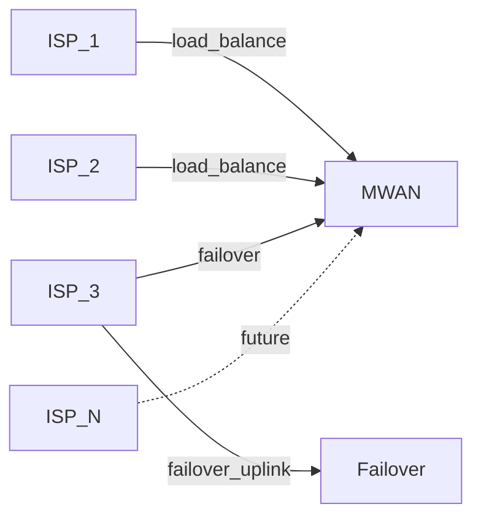
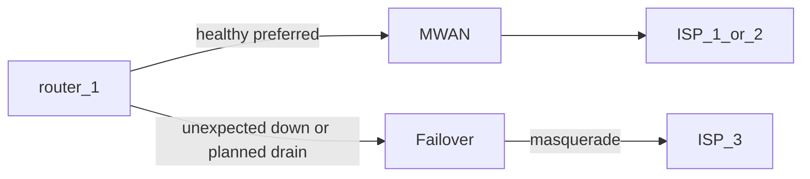

# MWAN

MWAN is the WAN chokepoint in front of the LAN router, so the router sees
one upstream. That chokepoint owns these jobs:

- MWAN load-balances packets across multiple ISPs.
- MWAN lets a downstream router mark specific packets to flow through a specific ISP.
- MWAN fails over when a WAN member or speaker cannot take traffic.
- MWAN translates addresses on the WAN chosen for the flow.

## Why it was built

OPNsense multi-WAN groups coupled WAN membership to firewall rules and
forced every rule a single-WAN setup had gotten for free. Outages looked
like random blackholes and were hard to diagnose after those groups failed.

MWAN exists so the LAN router keeps a single-WAN rule set.

## Architecture

Traffic crosses three layers, each with one job.

| Layer      | Job                                                                                       |
| ---------- | ----------------------------------------------------------------------------------------- |
| Upstream   | ISP links terminate on the chokepoint rather than on the LAN routers.                     |
| Chokepoint | All traffic passes through the primary or failover speaker in the chokepoint.             |
| Downstream | LAN routers and the LANs behind them peer over iBGP and announce the prefixes they route. |

| Mark        | Meaning                                                  |
| ----------- | -------------------------------------------------------- |
| Solid line  | A solid line marks a path that is in production today.   |
| Dashed line | A dashed line marks a future ISP or an extra LAN router. |

## Major components

The chokepoint is the layer all traffic passes through.

- **Primary speaker:** The primary speaker is the only speaker that
load-balances.
  - The primary speaker terminates the ISP links.
  - The primary speaker marks new flows onto a WAN.
  - The primary speaker translates addresses on the chosen WAN.
- **Failover speaker:** The failover speaker is a second BGP speaker on ISP-3 and
does not load-balance. The failover speaker masquerades so every outbound
flow can leave without a matching prefix. The failover speaker does not
serve inbound traffic. LAN routers prefer the primary speaker with
local-pref and use the failover speaker when the primary default goes away.
- **Watchdog:** The watchdog sits outside the chokepoint and rolls the
primary speaker back to a snapshot when a bad deploy breaks
connectivity.
- **LAN router:** Downstream routers do not run gateway groups or load
balancing. Each LAN router sees one upstream, so adding or removing an
ISP does not change its firewall. Each LAN router forwards to MWAN and
announces the prefixes it routes.
- **Binary:** The MWAN binary is a single monolith that each host runs
with the subcommands its role needs.

## Worked example

Numbers below are documentation-only and do not reflect production
addresses.

- IPv4 tables use TEST-NET prefixes from
[RFC 5737](https://www.rfc-editor.org/rfc/rfc5737.html).
- IPv6 tables use documentation prefixes from
[RFC 3849](https://www.rfc-editor.org/rfc/rfc3849.html).
- The ASN in the tables is a documentation ASN from
[RFC 5398](https://www.rfc-editor.org/rfc/rfc5398.html).
- Hostnames in the tables use the `example.test` suffix.
- All valid prefix lengths are supported, and prefix sizes in the tables
are examples.
- Internal addresses in the worked example use the documentation prefix
`fd06::/56`.

### Upstream

| Member | IPv4              | IPv6 PD            | Role                                                                                     |
| ------ | ----------------- | ------------------ | ---------------------------------------------------------------------------------------- |
| ISP-1  | `192.0.2.0/29`    | `2001:db8:1::/56`  | This member load-balances unmarked new flows onto this WAN.                              |
| ISP-2  | `198.51.100.0/29` | `2001:db8:2::/56`  | This member load-balances unmarked new flows onto this WAN.                              |
| ISP-3  | `203.0.113.0/29`  | `2001:db8:3::/56`  | This member is health failover on the primary speaker and the failover speaker's uplink. |
| ISP-N  | `192.0.2.16/29`   | `2001:db8:10::/56` | This future member is neither a load-balance member nor a failover member.               |

### Chokepoint

The chokepoint translates load-balanced flows with NPT for IPv6 and 1:1
SNAT for IPv4.

NPT replaces the internal prefix with the chosen WAN prefix and leaves
the rest of the address unchanged. The internal prefix and the WAN prefix
can differ in length, and when they differ the shorter prefix is
zero-extended first, per
[RFC 6296](https://www.rfc-editor.org/rfc/rfc6296.html) section 3.1. The
longer prefix then limits which internal subnets translate onto that WAN.

IPv4 is a 1:1 SNAT of each router's transit address onto the chosen WAN.

| Step                           | IPv4 address   |
| ------------------------------ | -------------- |
| Client                         | `10.0.0.10`    |
| After `router-1` SNAT          | `192.0.2.9`    |
| After MWAN 1:1 SNAT onto ISP-2 | `198.51.100.1` |

### Downstream

These hosts share one iBGP in ASN `64496`:

- The primary speaker participates in this iBGP network.
- The failover speaker participates in this iBGP network.
- Every LAN router participates in this iBGP network.

`router-1` prefers the primary speaker with local-pref.

Each router announces the prefixes it routes at a size of its choosing, and
MWAN installs what it hears and sends return traffic to that router.

| Router     | Announces          | Example host      | After NPT onto ISP-1 `2001:db8:1::/56` |
| ---------- | ------------------ | ----------------- | -------------------------------------- |
| `router-1` | `fd06::/64`        | `fd06::10`        | `2001:db8:1::10`                       |
| `router-1` | `fd06:0:0:4::/62`  | `fd06:0:0:5::10`  | `2001:db8:1:5::10`                     |
| `router-2` | `fd06:0:0:10::/60` | `fd06:0:0:10::10` | `2001:db8:1:10::10`                    |

Adding `router-2` is a future iBGP peer that announces what it routes and
needs no MWAN configuration change, as described in
[multiple downstream routers](superpowers/multirouter/spec.md).

| Host                      | Role              |
| ------------------------- | ----------------- |
| `gateway.example.test`    | Primary speaker   |
| `failover.example.test`   | Failover speaker  |
| `router-1.example.test`   | LAN router        |
| `router-2.example.test`   | Future LAN router |
| `hypervisor.example.test` | Watchdog host     |

### Forced WAN

A downstream router can force a flow onto one ISP by stamping
Differentiated Services Code Point, or DSCP, on the packet before it
reaches MWAN. DSCP is a six-bit field in the IP header, per
[RFC 2474](https://www.rfc-editor.org/rfc/rfc2474.html). Those bits survive
the routed hop, including after the router SNATs IPv4, so MWAN can still
see the tag when it cannot see the original client address.

MWAN assigns each ISP a firewall mark and policy-routes on that mark:

- Mark 1 policy-routes a flow onto ISP-1.
- Mark 2 policy-routes a flow onto ISP-2.
- Mark 3 policy-routes a flow onto ISP-3.

New unmarked flows receive a random mark for ISP-1 or ISP-2. A DSCP rule
runs first and sets the mark, so the load balancer's unmarked-only rule
leaves that flow alone.

OPNsense sets DSCP with a Normalization rule, and the filter generator
emits `set-tos` from the TOS / DSCP field on that rule. Firewall filter
rules can match DSCP, but they cannot set it.

In the worked example, `router-1` has a Normalization rule on the LAN:

- The source address is `fd06::10`.
- The protocol is any.
- The TOS / DSCP value is `cs1`.

When the client at `fd06::10` sends a packet, `router-1` stamps CS1 and
MWAN prerouting matches `ip6 dscp cs1` and sets mark 1. Policy routing
then sends the flow to ISP-1, and NPT rewrites the source to
`2001:db8:1::10`.

The IPv4 twin keeps that same CS1 tag after `router-1` SNATs the client
at `10.0.0.10` to `192.0.2.9`, and MWAN sets mark 1 and applies 1:1 SNAT
onto ISP-1.

### Failover

Failover reuses ordinary iBGP, so the primary speaker and the failover speaker both announce a default. Routers should prefer the primary speaker with local-pref and use the failover speaker when that default goes away, because there is no extra failover protocol.

| Situation                  | What BGP does                                                                                                               |
| -------------------------- | --------------------------------------------------------------------------------------------------------------------------- |
| Unexpected chokepoint down | The iBGP session drops, and routers take the failover speaker's default after the hold timer.                               |
| Planned maintenance        | The primary speaker withdraws its default first, and routers take the failover speaker's default before the host goes away. |

### Flows

- **Outbound IPv6:** A client at `fd06::10` sends a packet through
`router-1` to MWAN. MWAN marks the new flow onto ISP-1, and NPT rewrites
the source to `2001:db8:1::10`. Return traffic reverse-NPTs the
destination and returns to `router-1`.
- **Outbound IPv4:** A client at `10.0.0.10` is SNATed by `router-1` to
`192.0.2.9`. MWAN marks the flow onto ISP-2 and applies 1:1 SNAT to
`198.51.100.1`.
- **Inbound IPv6:** A packet addressed to `2001:db8:1::10` arrives on
ISP-1. MWAN reverse-NPTs the destination to `fd06::10` and forwards the
packet to `router-1`. The LAN router does not know that ISP-1 exists.
- **WAN health failover:** New flows move to ISP-1 when ISP-2 becomes
unhealthy. ISP-3 stays unused while any load-balance member remains
healthy. New flows use ISP-3 only after both load-balance members become
unhealthy.
- **Speaker failover:** `router-1` uses the failover speaker when the
primary speaker's default route goes away. The failover speaker
masquerades egress onto ISP-3 and does not accept inbound traffic.
- **Forced WAN:** `router-1` stamps DSCP CS1 on the packet. MWAN sets mark
1 before load-balancing, and the flow leaves on ISP-1.
- **Deploy rollback:** The watchdog restores the chokepoint from a snapshot
when a config push on `gateway.example.test` breaks connectivity. The
watchdog prefers the latest `pre-deploy-*` snapshot and uses a
`known-good-*` snapshot when no pre-deploy snapshot exists.
- **Future ISP-N:** The operator adds ISP-N with `192.0.2.16/29` and
`2001:db8:10::/56`. `router-1` still sees one upstream, so the router
firewall does not change.
- **Second router:** `router-2` joins iBGP and announces
`fd06:0:0:10::/60`. Return traffic follows that announcement, and MWAN
configuration does not change.

## Out-of-band management

The hypervisor reaches guests without using the guest IP stack when that
stack is down.

- **Primary and failover speakers:** vsock is a host-to-guest socket family
(`AF_VSOCK`) that rides virtio and does not use Ethernet or the guest
IP stack, as described in
[vsock(7)](https://www.man7.org/linux/man-pages/man7/vsock.7.html).
Each speaker's agent serves gRPC over vsock so these still work when
the guest network is down:
  - The speaker agent's health checks continue to report the guest state.
  - The speaker agent's configuration state remains available to the
  hypervisor.
  - The speaker agent can withdraw BGP routes during a network failure.
  The vsock channel works when the guest networking stack is not usable.
  Proxmox attaches vsock as a qemu virtio device on the guest, as
  described in
  [QEMU/KVM Virtual Machines](https://pve.proxmox.com/pve-docs/chapter-qm.html).
- **OPNsense:** FreeBSD guests cannot use vsock to the hypervisor, so
OPNsense talks over virtio-serial instead. Virtio-serial is a
paravirtual serial port that carries gRPC between the host and the
guest. A wedge-proof host path keeps the qemu character device open so
the guest cannot wedge that channel permanently, as described in
[wedge-proof serial](superpowers/wedgeproof/spec.md).

## Scalability

When the LAN router and the chokepoint run as separate guests on a
virtual NIC, the hypervisor copies each packet on that hop.

MWAN programs these in the guest kernel, so forwarded packets stay inside
those kernels and the daemon does not copy packet bytes in userspace:

- MWAN programs routes in the guest kernel.
- MWAN programs policy rules in the guest kernel.
- MWAN programs nftables rules in the guest kernel.

**Host copies:** The hypervisor copies each packet between guests that
share a virtual NIC on the same host. PCI passthrough of the physical NIC
to one guest skips that copy on that hop.

A LAN client on the worked-example path ran a public speedtest on
16 August 2026 and reached 1782 Mbit/s upload and 693 Mbit/s download.
Hypervisor copy threads peaked at 1.11 cores on a 12-core host. Faster
links were not measured, so this page has no figure for them.

### Sample scenarios

These hops choose their attach independently:

- The WAN hop connects each ISP to the chokepoint.
- The router-to-chokepoint hop connects each LAN router to MWAN.

**PCI passthrough:** Proxmox PCI passthrough gives the ISP NIC to the
chokepoint, so the NIC places packets directly into that guest's kernel.
The WAN hop has no hypervisor copy of those packets, as described in
[PCI(e) Passthrough](https://pve.proxmox.com/wiki/PCI(e)_Passthrough).

**Virtual WAN:** The ISP network interface stays attached to the host, so
the host copies each packet into the chokepoint guest and the WAN hop
pays that copy for every packet.

**Two guests on one host bridge:** The router and the chokepoint run as
separate guests. Every LAN packet to the chokepoint takes these host
copies:

1. The hypervisor copies the packet into the host kernel.
2. The host bridge forwards that packet toward the chokepoint guest.
3. The hypervisor copies the packet out to the chokepoint guest.

| Scenario                      | Where host copies run                                  |
| ----------------------------- | ------------------------------------------------------ |
| PCI passthrough               | No host copy runs on the WAN hop                       |
| Virtual WAN                   | A host copy runs on the WAN hop                        |
| Two guests on one host bridge | A host copy runs on every LAN packet to the chokepoint |

In the worked example:

- ISP-1 uses PCI passthrough on the WAN hop.
- ISP-2 uses PCI passthrough on the WAN hop.
- ISP-3 uses Virtual WAN on the WAN hop.

Every LAN packet to the chokepoint also takes the two-guest bridge.

PCI passthrough of the ISP NIC removes host copies from the WAN hop. Host
copies remain on the two-guest hop for as long as the router and the
chokepoint stay separate guests on one bridge.

### Measured path

Client `fd06::10` sits behind `router-1` and leaves on ISP-1, which uses
PCI passthrough so the WAN hop has no host copy. The packet then crosses
the two-guest bridge and DMAs out ISP-1.

On 16 August 2026, a LAN client ran a public speedtest on this path and
reached 693 Mbit/s down and 1782 Mbit/s up. The two-guest bridge cost
1.11 CPU cores at the upload peak. That is the copy work the hypervisor
would not do if the router and the chokepoint shared one kernel.

The table compares CPU on the 12-core host before the test and at the
upload peak. Copy threads are the hypervisor threads that move packets
between the two guests. Guest forwarding is the CPU each guest kernel
spent on routing and NAT.

| Measure                            | Before the test | At the upload peak               |
| ---------------------------------- | --------------- | -------------------------------- |
| Copy threads, router guest         | 0.01 cores      | 0.59 cores                       |
| Copy threads, chokepoint guest     | 0.01 cores      | 0.52 cores                       |
| Copy threads, both guests          | 0.02 cores      | 1.11 cores, about 9% of the host |
| Guest forwarding, router guest     | not measured    | 4.54 cores                       |
| Guest forwarding, chokepoint guest | not measured    | 2.01 cores                       |

At 1782 Mbit/s the copies cost about one core, and the guests' own
forwarding cost about six and a half cores. The copies were about 15% of
the CPU the traffic used. Faster links were not measured, so this page
does not state a cost at 10 Gbit/s or above.

### Conclusion

Two future changes could remove host copy work:

- Running the chokepoint in a Linux container would let the host and
chokepoint share one kernel.
- Running OPNsense on physical hardware would remove virtual-host
processing from the router hop.

The measured copy work did not limit speed on the 12-core test host. The
test did not isolate why download was slower than upload because other
clients used download bandwidth during the measurement.
